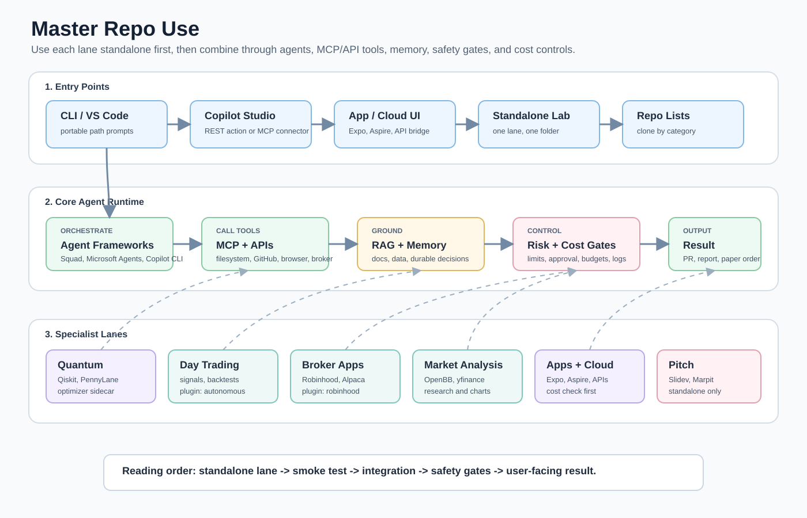

# Master Repo Use

Last curated: 2026-06-22

This repo is a readable command center for agent frameworks, RAG, memory, MCP servers, token/context management, Microsoft Copilot Studio connections, autonomous day-trading/investing agents, finance/trading agents, quantum computing experiments, cloud/cost reduction, app templates, and standalone pitch/hackathon resources.



Read the ecosystem map from left to right. Start with the entry point you actually use on that computer, route into the core agent runtime, then attach only the specialist lane you need. Pitch and hackathon stay as standalone output/support, while quantum and broker work sit behind safety gates.

## Visual Guides

### Standalone setup

Use this when you are on a new computer or testing one lane by itself. The path prompts are intentional: each machine can choose its own storage location.


### Combination map

Use this when you want to understand how CLI agents, Copilot Studio, MCP servers, RAG, memory, cost controls, market tools, quantum tools, and apps fit together.


### Quantum trading safety

Use this for the quantum/finance sidecar. The diagram keeps quantum experiments behind classical baselines, deterministic risk checks, paper mode, and human approval.


### Broker app integration

Use this for Robinhood-style apps, Alpaca, IBKR, Schwab, Tradier, Tastytrade, SnapTrade, Coinbase, and similar broker routes. The default path is research or paper trading.


### Autonomous day trading

Use this for agents that can generate signals, backtest, paper trade, propose investment allocations, and eventually connect to broker adapters. It cannot promise profit; live trading stays behind explicit approval.


### Cost control

Use this before scaling agents across repos, APIs, MCP servers, cloud accounts, broker data, or quantum jobs.


## Start Here

| Need | Go here |
| --- | --- |
| See the main integration flow | [Integration flows](docs/INTEGRATION-FLOWS.md) |
| See every repo and what it is for | [Repo catalog](docs/REPO-CATALOG.md) |
| Use any lane by itself before integrating it | [Standalone usage](docs/STANDALONE-USAGE.md) |
| Copy one-liners for PowerShell, WSL, Bash, Git, and GitHub CLI | [CLI one-liners](docs/CLI-ONE-LINERS.md) |
| Let an agent reach more folders safely | [Agent access guide](docs/AGENT-ACCESS.md) |
| Connect Microsoft Copilot Studio to agents, APIs, or MCP | [Copilot Studio integration](docs/COPILOT-STUDIO-INTEGRATION.md) |
| Add quantum computing as a standalone lane or sidecar | [Quantum guide](quantum/README.md) |
| Build a risk-gated quantum trading agent/plugin | [Quantum trading guide](quantum/QUANTUM-TRADING.md) |
| Build autonomous day-trading and investing agents | [Autonomous day-trading guide](docs/AUTONOMOUS-DAY-TRADING.md) |
| Connect Robinhood or similar broker apps safely | [Broker app integrations](docs/BROKER-APP-INTEGRATIONS.md) |
| Add stock, trading, Robinhood, and market analysis repos | [Trading and market agents](docs/TRADING-MARKET-AGENTS.md) |
| Reduce MCP, model API, and cloud cost | [Cost reduction guide](cost-reduction/README.md) |
| Use curated repo lists in scripts | [repo-lists/all-curated.txt](repo-lists/all-curated.txt) |

## Main Flow

The core stack is:

```text
CLI, VS Code, Copilot Studio, app UI, or automation
  -> agent framework or hosted agent
  -> MCP tools and normal APIs
  -> RAG, memory, context control, and cost controls
  -> app, cloud service, or local workflow
```

Quantum, finance/trading, and pitch/hackathon are separate lanes. They can connect to the core stack, but they are not required for the main agent workflow.

```text
Standalone lanes:
  quantum labs -> optional optimization/QML sidecar
  market agents -> optional research and paper-trading sidecar
  pitch/hackathon -> standalone demo/story materials
```

## Quick Clone

PowerShell:

```powershell
$RepoPath = Read-Host "Where should Master-Repo-Use be cloned?"; git clone https://github.com/Charlesganu2004/Master-Repo-Use.git $RepoPath; Set-Location $RepoPath
```

WSL or Bash:

```bash
read -rp "Where should Master-Repo-Use be cloned? " repo_path; git clone https://github.com/Charlesganu2004/Master-Repo-Use.git "$repo_path" && cd "$repo_path"
```

GitHub CLI:

```bash
read -rp "Where should Master-Repo-Use be cloned? " repo_path; gh repo clone Charlesganu2004/Master-Repo-Use "$repo_path" && cd "$repo_path"
```

## Reading Tabs

<details>
<summary><strong>1. Core agent system</strong></summary>

Use this when you want agents that can reason over a repo, call tools, remember project facts, and run from the terminal or a product surface.

- Agent frameworks: Squad, Microsoft Agents, Copilot CLI, RunAgent.
- Knowledge: LightRAG, Upstash, AugmentR, RAG CLI.
- Memory: AgentMemory, mem0, durable handoff prompts.
- Context/cost: Context Gateway, LLMLingua, token optimizer MCP servers.
- MCP access: filesystem, GitHub, Playwright, docs, databases, cloud tools.

</details>

<details>
<summary><strong>2. Microsoft Copilot Studio connections</strong></summary>

Copilot Studio can sit in front of the stack as the business-facing agent. Connect it to:

- Existing APIs through custom connectors or OpenAPI actions.
- MCP servers through the Copilot Studio MCP custom connector path.
- Microsoft 365 Agents SDK services when the agent needs a full-code backend.
- RAG or finance/quantum services through a small API bridge.

See [docs/COPILOT-STUDIO-INTEGRATION.md](docs/COPILOT-STUDIO-INTEGRATION.md).

</details>

<details>
<summary><strong>3. Quantum as standalone or sidecar</strong></summary>

Quantum is not the main focus of this repo. Treat it as:

- Standalone learning: Qiskit, PennyLane, Cirq, Q#, Braket, D-Wave.
- Sidecar optimization: portfolio optimization, routing, scheduling, scenario selection.
- Research lane: quantum machine learning, quantum finance, error mitigation.

See [quantum/README.md](quantum/README.md).

</details>

<details>
<summary><strong>4. Trading and market agents</strong></summary>

This lane is for research, market analysis, paper trading, and tool exploration. Keep live trading separate until code, risk controls, broker permissions, and compliance are audited.

- Autonomous day trading: safe plugin scaffold, signal generation, backtests, investing allocation proposals, paper trading.
- Robinhood lane: `robin_stocks`, Robinhood Crypto API docs, example research-agent prompt.
- Market analysis: OpenBB, FinRobot, FinGPT, yfinance, mplfinance.
- Trading agents/backtesting: TradingAgents, AI-Trader, FinRL, Lean, Backtrader, Freqtrade.

See [docs/AUTONOMOUS-DAY-TRADING.md](docs/AUTONOMOUS-DAY-TRADING.md).
See [docs/TRADING-MARKET-AGENTS.md](docs/TRADING-MARKET-AGENTS.md).

</details>

<details>
<summary><strong>5. Pitch and hackathon stays standalone</strong></summary>

Pitch and hackathon tools are not part of the main runtime stack. Keep them as standalone support:

- `awesome-hackathon` for planning and resources.
- `slidev` and `marpit` for decks.
- `pitch-deck` for pitch structure and review.

They can consume summaries from the core stack, but they should not be treated as required agent infrastructure.

</details>

## Decision Map

| If you want to... | Start with | Then add |
| --- | --- | --- |
| Build agent teams | `bradygaster/squad`, `microsoft/agents`, `microsoft/Agents-for-net` | RAG, memory, MCP tools |
| Build terminal-native workflows | `github/copilot-cli`, `runagent-dev/runagent`, `satoshiman/rag-cli` | Context management and repo lists |
| Ground agents in docs | `HKUDS/LightRAG`, `upstash/vector-js`, `upstash/rag-chat` | AgentMemory and context compression |
| Connect Copilot Studio | Copilot Studio custom connectors or MCP connector | API bridge, MCP server, Microsoft Agents SDK |
| Add MCP servers | `modelcontextprotocol/servers`, `microsoft/playwright-mcp`, `github/github-mcp-server` | Toolsets, allowlists, token budgets |
| Reduce cost | `infracost/infracost`, `opencost/opencost`, `Compresr-ai/Context-Gateway` | Token compression, tool allowlists, cloud policies |
| Add market analysis | `OpenBB-finance/OpenBB`, `ai4finance-foundation/finrobot`, `tauricresearch/tradingagents` | RAG, broker APIs, risk checks |
| Build autonomous day-trading agents | `plugins/autonomous-day-trading-agent`, `HKUDS/Vibe-Trading`, `alpacahq/alpaca-mcp-server` | Backtests, paper broker, risk gates, human approval |
| Add quantum experiments | `Qiskit/qiskit`, `PennyLaneAI/pennylane`, `qiskit-community/qiskit-finance` | Optimization sidecar, finance research lane |
| Build quantum trading safely | `plugins/quantum-trading-agent`, `alpaca-py`, `qiskit-finance` | Risk gates, paper broker, human approval |
| Connect broker apps | `plugins/robinhood-trading-agent`, `alpaca-py`, `ib_async`, `schwab-py`, `tradier` | Paper mode, broker adapters, approval gates |
| Ship mobile or web apps | `expo/expo`, `expo/examples`, `create-expo-stack` | Agent API backend and RAG |
| Demo or pitch the work | `slidevjs/slidev`, `marp-team/marpit`, `awesome-hackathon` | Standalone only |

## Local Access Model

Do not think of agent access as "the whole computer or nothing." Treat it like folder-by-folder permission.


Recommended access levels:

| Level | Use for | Example |
| --- | --- | --- |
| Workspace only | Normal coding tasks | `<PATH_TO_THIS_REPO>` |
| Project lab | Multi-repo experiments | `<PATH_TO_AGENT_LAB>` |
| Documents or Downloads | Personal file workflows | Add only the folder needed |
| Whole drive | Rare, high trust, high risk | Prefer not to do this |

The [filesystem MCP server](https://github.com/modelcontextprotocol/servers/tree/main/src/filesystem) supports allowed directories and MCP Roots. The [GitHub MCP Server](https://github.com/github/github-mcp-server) supports toolsets and read-only modes so GitHub access can also be scoped.

## Source Notes

This README and the docs were built from the linked repositories plus current public docs/articles:

- [Microsoft Copilot Studio MCP connector docs](https://learn.microsoft.com/en-us/microsoft-copilot-studio/mcp-add-existing-server-to-agent)
- [Microsoft Copilot Studio REST API action docs](https://learn.microsoft.com/en-us/microsoft-copilot-studio/agent-extend-action-rest-api)
- [GitHub Copilot CLI context management](https://docs.github.com/en/copilot/concepts/agents/copilot-cli/context-management)
- [GitHub custom agents changelog](https://github.blog/changelog/2025-10-28-custom-agents-for-github-copilot/)
- [Claude automatic context compaction cookbook](https://platform.claude.com/cookbook/tool-use-automatic-context-compaction)
- [GitHub topic: context-compaction](https://github.com/topics/context-compaction)
- [Fungies AI agent repository article](https://fungies.io/top-github-repositories-ai-agent-frameworks-2026/)
- [Robinhood Agentic Trading](https://robinhood.com/us/en/support/articles/agentic-trading/)
- [Alpaca paper trading docs](https://docs.alpaca.markets/docs/paper-trading)

## Repo Structure

```text
.
|-- README.md
|-- assets/
|   |-- agent-access-map.svg
|   |-- broker-app-agent-flow.svg
|   |-- combination-use-map.svg
|   |-- cost-reduction-flow.svg
|   |-- day-trading-agent-flow.svg
|   |-- master-repo-map.svg
|   |-- quantum-trading-agent-flow.svg
|   `-- standalone-setup-flow.svg
|-- cost-reduction/
|   `-- README.md
|-- docs/
|   |-- AGENT-ACCESS.md
|   |-- AUTONOMOUS-DAY-TRADING.md
|   |-- CLI-ONE-LINERS.md
|   |-- COPILOT-STUDIO-INTEGRATION.md
|   |-- INTEGRATION-FLOWS.md
|   |-- MCP-SERVERS.md
|   |-- REPO-CATALOG.md
|   |-- STANDALONE-USAGE.md
|   `-- TRADING-MARKET-AGENTS.md
|-- examples/
|-- plugins/
|   |-- autonomous-day-trading-agent/
|   |-- robinhood-trading-agent/
|   `-- quantum-trading-agent/
|-- quantum/
|   |-- QUANTUM-TRADING.md
|   `-- README.md
`-- repo-lists/
```
