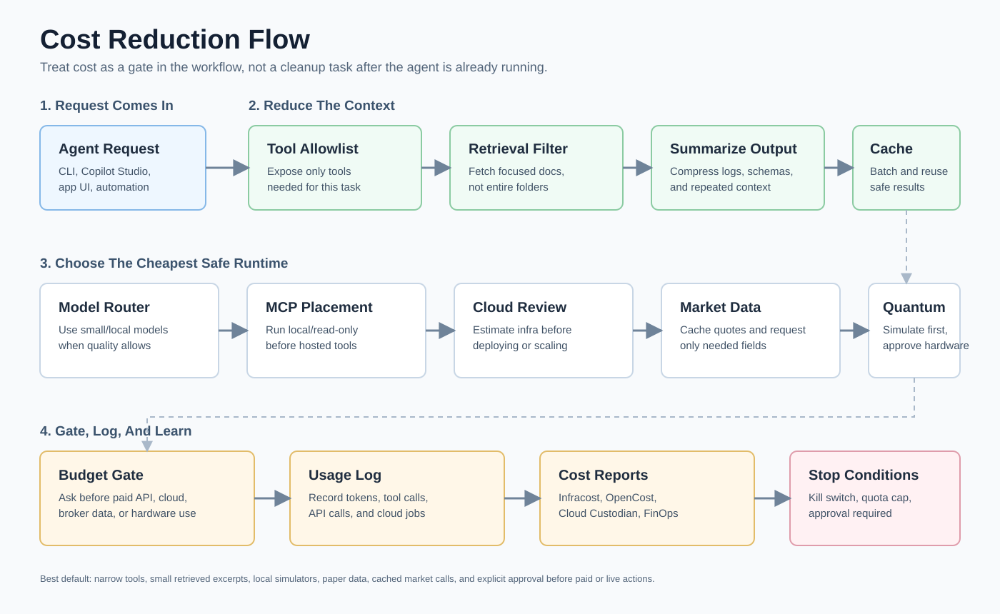

# Cost Reduction Lane

This folder tracks ways to reduce MCP server cost, model/API cost, cloud cost, and agent workflow cost.



Read this diagram as the cost path every large workflow should pass through: narrow the tools, narrow retrieval, summarize output, reuse cached data, choose the cheapest safe runtime, then log usage and stop when budget rules say to stop.

## Cost Buckets

| Bucket | What creates cost | How to reduce it |
| --- | --- | --- |
| Model/API tokens | Long prompts, large tool schemas, huge tool outputs, repeated context | Compression, retrieval filters, small summaries, narrow toolsets |
| MCP servers | Hosted compute, external API calls, tool-call fanout, large schemas | Run locally when possible, cache, limit tools, read-only mode |
| Cloud infrastructure | Idle VMs, Kubernetes waste, expensive resources, drift | Infracost, OpenCost, Cloud Custodian, Komiser, CloudQuery, Steampipe |
| Market data and broker APIs | Paid data feeds, rate limits, repeated downloads | Cache, batch, use paper data, request only needed fields |
| Quantum/cloud jobs | Paid simulators/hardware/cloud execution | Local simulator first, budget gate, explicit approval |

## Flow

```text
Agent request
  -> choose only needed tools
  -> retrieve only needed docs/data
  -> compress or summarize tool output
  -> route to cheaper/local model when acceptable
  -> estimate cloud/API impact
  -> run with budget logging
```

## Repos

| Repo | Use it when | Connects to |
| --- | --- | --- |
| [Compresr-ai/Context-Gateway](https://github.com/Compresr-ai/Context-Gateway) | You want context compression in front of agent workflows. | MCP/tool output reduction and long sessions. |
| [microsoft/LLMLingua](https://github.com/microsoft/LLMLingua) | You want prompt compression research/tools. | Custom RAG and API pipelines. |
| [ooples/token-optimizer-mcp](https://github.com/ooples/token-optimizer-mcp) | You want an MCP server focused on token optimization. | MCP cost reduction experiments. |
| [yvgude/lean-ctx](https://github.com/yvgude/lean-ctx) | You want a context engineering / lean context utility. | Agent context cleanup. |
| [chopratejas/headroom](https://github.com/chopratejas/headroom) | You want prompt/context headroom tracking ideas. | Long agent sessions and context limits. |
| [infracost/infracost](https://github.com/infracost/infracost) | You want cloud cost estimates for infrastructure changes. | PR review, GitHub MCP, CI, CLI workflows. |
| [infracost/agent-skills](https://github.com/infracost/agent-skills) | You want agent skills related to Infracost. | Coding agents and infrastructure PRs. |
| [opencost/opencost](https://github.com/opencost/opencost) | You want Kubernetes cost monitoring. | Kubernetes agent/cloud workflows. |
| [opencost/opencost-helm-chart](https://github.com/opencost/opencost-helm-chart) | You want Helm deployment for OpenCost. | Kubernetes setup. |
| [cloud-custodian/cloud-custodian](https://github.com/cloud-custodian/cloud-custodian) | You want cloud governance and cleanup policies. | Cloud cost cleanup agents. |
| [mlabouardy/komiser](https://github.com/mlabouardy/komiser) | You want cloud resource inventory and cost visibility. | Multi-cloud cost review. |
| [cloudquery/cloudquery](https://github.com/cloudquery/cloudquery) | You want cloud asset inventory in databases. | Agent-accessible cloud inventory. |
| [turbot/steampipe](https://github.com/turbot/steampipe) | You want SQL over cloud APIs and cost/security queries. | CLI and dashboard workflows. |
| [phildougherty/infracost_mcp](https://github.com/phildougherty/infracost_mcp) | You want an MCP-shaped Infracost experiment. | Infrastructure cost review via agents. |
| [jasonwilbur/cloud-cost-mcp](https://github.com/jasonwilbur/cloud-cost-mcp) | You want an MCP server concept for cloud cost analysis. | Cloud cost agent experiments. |
| [OptimNow/finops-mcp-resources](https://github.com/OptimNow/finops-mcp-resources) | You want FinOps MCP resources. | MCP cost and FinOps discovery. |
| [OptimNow/cloud-finops-skills](https://github.com/OptimNow/cloud-finops-skills) | You want cloud FinOps agent skills. | Agent cost governance. |
| [aarora79/aws-cost-explorer-mcp-server](https://github.com/aarora79/aws-cost-explorer-mcp-server) | You want AWS Cost Explorer through MCP. | AWS spend analysis agents. |
| [nozomi-koborinai/gcp-cost-mcp-server](https://github.com/nozomi-koborinai/gcp-cost-mcp-server) | You want GCP cost data through MCP. | GCP spend analysis agents. |

## Cost Reduction Patterns

| Pattern | Use it for |
| --- | --- |
| MCP tool allowlist | Reduce tool schema size and accidental tool calls. |
| Read-only MCP mode | Lower risk and fewer destructive operations. |
| Retrieval before prompt | Send small excerpts instead of whole docs. |
| Summarize tool outputs | Reduce repeated long logs. |
| Cache expensive data | Market data, cloud inventory, docs, model outputs where valid. |
| Budget gate | Stop or ask before paid cloud, broker, or quantum calls. |
| PR cost checks | Use Infracost before merging infrastructure changes. |
| Kubernetes spend checks | Use OpenCost before scaling workloads. |

## One-Liners

Clone cost-reduction repos, PowerShell:

```powershell
$MasterRepo = Read-Host "Path to Master-Repo-Use"; $LanePath = Read-Host "Folder where cost-reduction repos should be cloned"; New-Item -ItemType Directory -Force $LanePath | Out-Null; Get-Content (Join-Path $MasterRepo "repo-lists\cost-reduction.txt") | Where-Object { $_ -and $_ -notmatch '^#' } | ForEach-Object { gh repo clone $_ (Join-Path $LanePath ($_ -replace '/','-')) }
```

Clone cost-reduction repos, WSL/Bash:

```bash
read -rp "Path to Master-Repo-Use: " master_repo; read -rp "Folder where cost-reduction repos should be cloned: " lane_path; mkdir -p "$lane_path"; grep -vE '^(#|$)' "$master_repo/repo-lists/cost-reduction.txt" | while read -r repo; do gh repo clone "$repo" "$lane_path/${repo/\//-}"; done
```

Install Infracost CLI with Chocolatey:

```powershell
choco install infracost
```

Install Infracost CLI with script, WSL/Bash:

```bash
curl -fsSL https://raw.githubusercontent.com/infracost/infracost/master/scripts/install.sh | sh
```

Run Infracost in a Terraform folder:

```bash
infracost breakdown --path .
```

Install Cloud Custodian:

```powershell
python -m pip install --user c7n
```

Run a local token/context reduction lab:

```powershell
python -m pip install --user llmlingua; npm install -g @agentmemory/agentmemory
```

## Agent Budget Prompt

```text
Before using paid APIs, cloud resources, market data, broker APIs, or quantum hardware, estimate cost and ask for approval. Prefer local simulation, cached data, read-only tools, and small retrieved excerpts.
```
