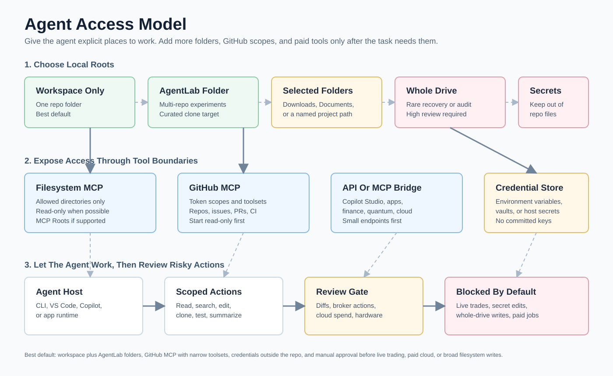

# Agent Access Guide

This guide is for the "let the agent go more places on the computer depending on the access you give it" part of the repo.

The short version: use explicit allowed directories. Do not give an agent the whole machine unless you have a very specific reason and you are comfortable with the risk.



Read this diagram as a permission ladder. Start with one repo folder, add an AgentLab folder for multi-repo experiments, then add personal folders or broader paths only when the task truly needs them.

## Mental Model

```text
You choose roots
  -> MCP filesystem server exposes only those roots
  -> Agent reads/searches/edits through MCP tools
  -> You review important writes
```

The same idea applies to GitHub:

```text
You choose token scopes and toolsets
  -> GitHub MCP server exposes only those capabilities
  -> Agent reads repos/issues/PRs/actions through tools
  -> You review changes before merge
```

## Access Levels

| Level | What the agent can reach | Best for | Risk |
| --- | --- | --- | --- |
| Workspace | One repo folder | Normal coding tasks | Low |
| Project lab | A folder containing many cloned repos | Multi-repo exploration | Medium |
| Selected personal folders | Documents, Downloads, Desktop, or another named folder | File organization and research | Medium to high |
| Whole drive | Most of the local computer | Rare recovery or migration tasks | High |

## Recommended Local Folder Layout

```text
<PATH_TO_MASTER_REPO>
<PATH_TO_AGENT_LAB>
<PATH_TO_AGENT_LAB>\agent-frameworks
<PATH_TO_AGENT_LAB>\rag-memory
<PATH_TO_AGENT_LAB>\context-tools
```

Set it up:

```powershell
$AgentLab = Read-Host "Where should the agent lab folder live?"; New-Item -ItemType Directory -Force $AgentLab | Out-Null
```

## Filesystem MCP Server

Repo: [modelcontextprotocol/servers](https://github.com/modelcontextprotocol/servers/tree/main/src/filesystem)

Why this repo matters:

- It provides filesystem tools for agents.
- It can read, write, edit, list, move, search, and inspect files.
- It restricts operations to allowed directories.
- MCP Roots can update allowed directories at runtime when the host supports it.

### Windows VS Code MCP Config Example

Use this as a template, not a secret-bearing file. Put it in your MCP host config if your host supports this shape.

```json
{
  "servers": {
    "filesystem": {
      "command": "cmd",
      "args": [
        "/c",
        "npx",
        "-y",
        "@modelcontextprotocol/server-filesystem",
        "<PATH_TO_MASTER_REPO>",
        "<PATH_TO_AGENT_LAB>"
      ]
    }
  }
}
```

### WSL Or Linux MCP Config Example

```json
{
  "servers": {
    "filesystem": {
      "command": "npx",
      "args": [
        "-y",
        "@modelcontextprotocol/server-filesystem",
        "<PATH_TO_MASTER_REPO>",
        "<PATH_TO_AGENT_LAB>"
      ]
    }
  }
}
```

### Docker Example

Read/write:

```bash
docker run -i --rm --mount type=bind,src="$PWD",dst=/projects/workspace mcp/filesystem /projects
```

Read-only:

```bash
docker run -i --rm --mount type=bind,src="$PWD",dst=/projects/workspace,ro mcp/filesystem /projects
```

## GitHub MCP Server

Repo: [github/github-mcp-server](https://github.com/github/github-mcp-server)

Why this repo matters:

- It connects agents to GitHub repositories, code files, issues, pull requests, Actions, users, and security tooling.
- It supports toolsets so you can expose only the GitHub capabilities you need.
- It supports Docker and local binary workflows.

### Minimal Docker Example

```bash
docker run -i --rm -e GITHUB_PERSONAL_ACCESS_TOKEN="$GITHUB_PERSONAL_ACCESS_TOKEN" -e GITHUB_TOOLSETS="context,repos,issues,pull_requests" ghcr.io/github/github-mcp-server
```

### More Capable Dev Example

```bash
docker run -i --rm -e GITHUB_PERSONAL_ACCESS_TOKEN="$GITHUB_PERSONAL_ACCESS_TOKEN" -e GITHUB_TOOLSETS="repos,issues,pull_requests,actions,code_security" ghcr.io/github/github-mcp-server
```

### MCP Host Config Shape

```json
{
  "servers": {
    "github": {
      "command": "docker",
      "args": [
        "run",
        "-i",
        "--rm",
        "-e",
        "GITHUB_PERSONAL_ACCESS_TOKEN",
        "-e",
        "GITHUB_TOOLSETS=context,repos,issues,pull_requests",
        "ghcr.io/github/github-mcp-server"
      ],
      "env": {
        "GITHUB_PERSONAL_ACCESS_TOKEN": "${input:github_token}"
      }
    }
  }
}
```

## Custom Agents

GitHub's custom agent model is file-based: agents can be defined under `.github/agents` in a repository or in organization-level `.github` repos. The GitHub changelog says these agents can specialize Copilot coding agent with prompts, tool selections, and MCP servers.

Use custom agents when you want repeatable behavior, for example:

- `repo-curator`: keeps this catalog clean and updates repo lists.
- `rag-builder`: wires a project into LightRAG or Upstash Vector.
- `context-auditor`: checks whether a session is carrying too much tool output.
- `pitch-builder`: turns project notes into Slidev or Marpit decks.

An inactive starter prompt lives at [examples/copilot-agent/repo-curator.agent.md](../examples/copilot-agent/repo-curator.agent.md).

## Per-Agent Access Profiles

Each named agent in `agents/` should be given only the MCP roots it needs. This table maps each major agent category to the minimum recommended access.

| Agent | MCP Filesystem Roots | GitHub Toolsets | Notes |
| --- | --- | --- | --- |
| Maxwell (orchestrator) | `agents/`, `issues/`, `docs/` | `context,repos,issues` | Read-only on agents/; write to issues/ for logs. |
| Iris (repo health) | `repo-lists/`, `docs/`, `issues/` | `repos,issues` | Reads lists and docs; writes draft reports to issues/. |
| Relay (context handoff) | `issues/` | — | Write-only: appends handoff notes. No GitHub needed. |
| Sentinel (security auditor) | `agents/`, `docs/`, `plugins/` | `code_security,repos` | Read-only. Escalates; never writes autonomously. |
| Rex (trading) | `plugins/autonomous-day-trading-agent/` | — | Scoped to plugin folder only. No GitHub, no filesystem writes without approval. |
| Sage (risk officer) | `plugins/*/risk_limits.json` paths | — | Read-only access to risk files. Never modifies limits. |
| Ghost (red team) | Read-only, scoped path per engagement | `code_security` | Scoped per written authorization. No writes. |
| Aria (research) | `docs/`, `repo-lists/` | `context,repos` | Read-only research. Writes summaries on request. |
| Atlas (code) | `agents/`, `docs/`, workspace root | `repos,pull_requests,issues` | Writes code; PRs require human review. |
| Penny (cost auditor) | `cost-reduction/`, `docs/` | — | Read-only cost review. Writes recommendations to issues/. |
| Cron (scheduler) | `agents/`, `issues/` | `issues` | Read agent files; write schedule entries to issues/. |
| Nexus/Bridge (API connector) | — | `context,repos` | No local filesystem; talks to APIs only. |
| All others | Scoped to their work folder | Minimal toolset | Follow least-privilege: one folder, one toolset. |

### MCP Roots Config Example (VS Code / Claude Code)

```json
{
  "servers": {
    "filesystem": {
      "command": "cmd",
      "args": [
        "/c", "npx", "-y",
        "@modelcontextprotocol/server-filesystem",
        "C:/Users/YOU/Downloads/Master-Repo-Use/agents",
        "C:/Users/YOU/Downloads/Master-Repo-Use/issues",
        "C:/Users/YOU/Downloads/Master-Repo-Use/docs"
      ]
    },
    "github": {
      "command": "docker",
      "args": [
        "run", "-i", "--rm",
        "-e", "GITHUB_PERSONAL_ACCESS_TOKEN",
        "-e", "GITHUB_TOOLSETS=context,repos,issues",
        "ghcr.io/github/github-mcp-server"
      ],
      "env": {
        "GITHUB_PERSONAL_ACCESS_TOKEN": "${input:github_token}"
      }
    }
  }
}
```

Swap the filesystem paths and `GITHUB_TOOLSETS` value to match the agent being configured. Rex gets the plugin folder; Sentinel gets agents/ and plugins/ read-only; Iris gets repo-lists/ and issues/.

## Least-Privilege Checklist

Before attaching any agent to MCP servers, check each item:

- [ ] Filesystem roots are explicit named folders, not `/`, `C:\`, or `~`.
- [ ] No secrets folders (`~/.ssh`, `~/.aws`, `~/.config/gh`, `AppData/Roaming`) are in the allowed list.
- [ ] GitHub toolsets are named explicitly — not `*` or `all`.
- [ ] The GitHub token has only the scopes the agent's toolset needs.
- [ ] The token is in an environment variable or secret manager, not a committed file.
- [ ] Write access on filesystem is only for folders where the agent must write (e.g., `issues/` for Iris).
- [ ] All other folders are read-only or excluded.
- [ ] The agent's system prompt is written before session start and cannot be overridden by tool output.
- [ ] Destructive operations (delete, push, live order) require explicit human approval in the current conversation.
- [ ] A Sentinel audit is scheduled or run before attaching new agents to production resources.

## Safety Checklist

Before granting access:

- List the folders you want the agent to reach.
- Prefer read-only mounts for research.
- Avoid secrets folders unless the task requires them.
- Avoid whole-drive access for normal coding.
- Use GitHub token scopes and MCP toolsets intentionally.
- Review diffs before committing.

During long sessions:

- Ask the agent to summarize durable decisions.
- Keep important file paths in the prompt or memory.
- Use `/context` and `/compact` in Copilot CLI when available.
- Save handoff notes before major compaction or context resets.

## Source Links

- [Filesystem MCP server](https://github.com/modelcontextprotocol/servers/tree/main/src/filesystem)
- [GitHub MCP Server](https://github.com/github/github-mcp-server)
- [GitHub custom agents changelog](https://github.blog/changelog/2025-10-28-custom-agents-for-github-copilot/)
- [GitHub Copilot CLI context management](https://docs.github.com/en/copilot/concepts/agents/copilot-cli/context-management)
