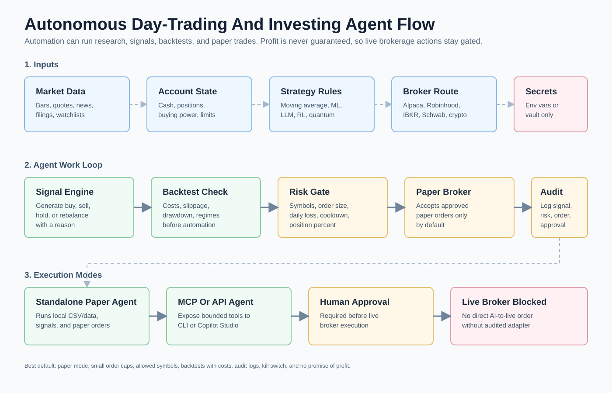

# Autonomous Day-Trading And Investing Agents

This guide covers agents, repos, and plugin scaffolds that can run market research, day-trading signals, paper orders, investment allocation proposals, and broker-adapter experiments.

Important: no agent, repo, model, or strategy can promise to make money. A trading agent can lose money quickly. Keep this lane paper-first until the strategy, broker route, risk controls, data source, legal/compliance requirements, and human approval flow are reviewed.



Read this diagram as the safe version of "do day trading for me." The agent can watch data, generate signals, backtest, propose orders, paper trade, and log decisions. Live broker execution remains blocked until a human deliberately enables and reviews an audited adapter.

## What This Lane Can Do

| Capability | Safe default |
| --- | --- |
| Watch market data | Read-only data, cached where possible. |
| Generate day-trading signals | Explain buy, sell, hold, or rebalance proposals. |
| Backtest strategies | Include costs, slippage, drawdown, and out-of-sample checks. |
| Paper trade automatically | Run against a paper broker or sandbox. |
| Invest or rebalance | Produce allocation proposals behind risk gates. |
| Connect to brokers | Use sandbox/paper first; live adapters need approval. |
| Use LLM/ML/RL/quantum | Compare against simple classical baselines. |

## What This Lane Must Not Promise

- Guaranteed profit.
- "Set and forget" live trading.
- Direct AI-to-broker live execution from a prompt.
- Bypassing broker permissions, PDT/margin rules, taxes, compliance, or risk limits.
- Trading unapproved assets, options, leverage, or short positions by default.

## Starter Plugin

Use [plugins/autonomous-day-trading-agent](../plugins/autonomous-day-trading-agent/README.md) when you want this repo's standalone automation scaffold.

It provides:

- Moving-average signal generation from CSV OHLCV bars.
- Simple backtest summary.
- Risk-gated trade proposals.
- Paper-order mode.
- Investing allocation proposal mode.
- Live-order blocker.
- CLI commands that work in PowerShell, WSL, Bash, or normal CLI shells.

PowerShell:

```powershell
$PluginPath = Read-Host "Path to plugins\autonomous-day-trading-agent"; Set-Location $PluginPath; python -m venv .venv; .\.venv\Scripts\Activate.ps1; python -m pip install --upgrade pip; python -m pip install -e .; autonomous-day-trading-agent smoke-test --risk risk_limits.example.json
```

WSL/Bash:

```bash
read -rp "Path to plugins/autonomous-day-trading-agent: " plugin_path; cd "$plugin_path"; python3 -m venv .venv && source .venv/bin/activate && python -m pip install --upgrade pip && python -m pip install -e . && autonomous-day-trading-agent smoke-test --risk risk_limits.example.json
```

## Repos For Autonomous Trading Agents

| Repo or docs | Use it when | Default |
| --- | --- | --- |
| [HKUDS/Vibe-Trading](https://github.com/HKUDS/Vibe-Trading) | You want agentic trading experiments connected to the Robinhood Agentic Trading/MCP idea. | Research and paper flow first. |
| [HKUDS/AI-Trader](https://github.com/HKUDS/AI-Trader) | You want an agent-native automated trading research repo. | Paper/simulation first. |
| [tauricresearch/tradingagents](https://github.com/tauricresearch/tradingagents) | You want multi-agent financial debate/research workflows. | Research, not direct live orders. |
| [TradingAgents-AI/TradingAgents](https://github.com/TradingAgents-AI/TradingAgents) | You want another TradingAgents implementation to compare. | Research and paper mode. |
| [LIU-HONGYANG-GZU/Live_Trade_Bench](https://github.com/LIU-HONGYANG-GZU/Live_Trade_Bench) | You want a benchmark for LLM financial trading agents. | Evaluation before automation. |
| [ai4finance-foundation/finrobot](https://github.com/ai4finance-foundation/finrobot) | You want financial report and analyst agents. | Research reports and signal context. |
| [AI4Finance-Foundation/FinGPT](https://github.com/AI4Finance-Foundation/FinGPT) | You want financial LLM research. | Sentiment and finance language tasks. |
| [AI4Finance-Foundation/FinRL](https://github.com/AI4Finance-Foundation/FinRL) | You want financial reinforcement learning. | Simulated training and walk-forward evaluation. |
| [MingyuJ666/Stockagent](https://github.com/MingyuJ666/Stockagent) | You want simulated stock-agent environments. | Simulation first. |
| [qmyhd/LLM-portfolio-project](https://github.com/qmyhd/LLM-portfolio-project) | You want LLM portfolio allocation examples. | Allocation research only. |
| [fsaavedra0003/Agentic-AI-Trading-Bot-with-LLM-reasoning-sentiment-analysis](https://github.com/fsaavedra0003/Agentic-AI-Trading-Bot-with-LLM-reasoning-sentiment-analysis) | You want an LLM reasoning/sentiment trading bot example. | Study and paper mode. |

## Repos For Day-Trading Execution, Backtesting, And Paper Trading

| Repo or docs | Use it when | Default |
| --- | --- | --- |
| [alpacahq/alpaca-py](https://github.com/alpacahq/alpaca-py) | You want an official Python SDK with paper trading support. | Paper account first. |
| [alpacahq/alpaca-mcp-server](https://github.com/alpacahq/alpaca-mcp-server) | You want broker/account tools exposed through MCP. | Paper toolsets first. |
| [quantconnect/Lean](https://github.com/quantconnect/Lean) | You want a mature algorithmic trading engine. | Backtest and paper/live review. |
| [nautechsystems/nautilus_trader](https://github.com/nautechsystems/nautilus_trader) | You want a professional-grade trading/backtesting engine. | Simulation and paper first. |
| [Lumiwealth/lumibot](https://github.com/Lumiwealth/lumibot) | You want a Python trading/backtesting framework with broker integrations. | Backtest and paper trade. |
| [AsyncAlgoTrading/aat](https://github.com/AsyncAlgoTrading/aat) | You want async algorithmic trading tooling. | Simulation first. |
| [vnpy/vnpy](https://github.com/vnpy/vnpy) | You want a broad trading platform framework. | Sim/paper mode first. |
| [kernc/backtesting.py](https://github.com/kernc/backtesting.py) | You want simple Python backtests. | Good first baseline. |
| [pmorissette/bt](https://github.com/pmorissette/bt) | You want portfolio-style backtesting. | Allocation baseline. |
| [mementum/backtrader](https://github.com/mementum/backtrader) | You want classic Python strategy testing. | Historical backtests. |
| [freqtrade/freqtrade](https://github.com/freqtrade/freqtrade) | You want crypto bot/backtesting tooling. | Dry-run first. |
| [Jesse-ai/jesse](https://github.com/Jesse-ai/jesse) | You want crypto strategy research/backtesting. | Simulation and paper first. |

## Broker And App Routes

| Route | Use it when | Notes |
| --- | --- | --- |
| [Robinhood Agentic Trading](https://robinhood.com/us/en/support/articles/agentic-trading/) | You want Robinhood's agent-oriented trading/MCP path where available. | Review official availability, limits, OAuth, and safety controls before use. |
| [Robinhood Crypto Trading API](https://docs.robinhood.com/crypto/trading/) | You want official Robinhood crypto API behavior. | Crypto only; keep dry-run/paper first. |
| [Alpaca paper trading](https://docs.alpaca.markets/docs/paper-trading) | You want equities/crypto paper trading designed for automation. | Strong first broker route. |
| [Interactive Brokers API](https://www.interactivebrokers.com/campus/ibkr-api-page/trader-workstation-api/) | You want a broad broker API. | Requires careful permission and account setup. |
| [QuantConnect Lean docs](https://www.quantconnect.com/docs/v2/writing-algorithms/key-concepts/algorithm-engine) | You want engine-backed algorithm development. | Backtest before live. |

## Profit-Seeking Workflow

Use this path when the goal is "try to make money" without pretending results are guaranteed:

```text
strategy idea
  -> historical data
  -> simple baseline
  -> backtest with fees, spread, slippage, and drawdown
  -> walk-forward/out-of-sample test
  -> paper trade
  -> risk review
  -> human approval
  -> audited live broker adapter
```

Minimum acceptance checks before live:

| Check | Why |
| --- | --- |
| Out-of-sample period | Prevents fitting only the past. |
| Walk-forward testing | Shows whether the strategy survives regime changes. |
| Costs and slippage | Many day-trading ideas fail after costs. |
| Max drawdown limit | Stops strategies that can wipe out an account. |
| Trade count sanity | Avoids conclusions from too few trades. |
| Risk gate pass | Confirms symbol, size, position, and daily loss limits. |
| Paper trading record | Confirms behavior with real-time data. |
| Manual approval | Prevents accidental live automation. |

## Autonomous Modes

| Mode | What it does | Live trading |
| --- | --- | --- |
| Research mode | Summarizes market data, filings, news, and charts. | No. |
| Signal mode | Generates buy/sell/hold proposals with reasons. | No. |
| Paper mode | Automatically submits approved paper orders. | No. |
| Rebalance mode | Proposes investments and allocations. | No by default. |
| Live adapter mode | Sends orders to a real broker adapter. | Only after explicit approval and audit. |

## One-Liners

Clone autonomous day-trading repos, PowerShell:

```powershell
$MasterRepo = (Get-Location).Path  # run from repo root; $LanePath = Read-Host "Folder where autonomous day-trading repos should be cloned"; New-Item -ItemType Directory -Force $LanePath | Out-Null; Get-Content (Join-Path $MasterRepo "repo-lists\autonomous-day-trading-agents.txt") | Where-Object { $_ -and $_ -notmatch '^#' } | ForEach-Object { gh repo clone $_ (Join-Path $LanePath ($_ -replace '/','-')) }
```

Clone autonomous day-trading repos, WSL/Bash:

```bash
read -rp "Path to Master-Repo-Use: " master_repo; read -rp "Folder where autonomous day-trading repos should be cloned: " lane_path; mkdir -p "$lane_path"; grep -vE '^(#|$)' "$master_repo/repo-lists/autonomous-day-trading-agents.txt" | while read -r repo; do gh repo clone "$repo" "$lane_path/${repo/\//-}"; done
```

Install a paper-trading research stack:

```powershell
$LabPath = Read-Host "Folder for day-trading research lab"; New-Item -ItemType Directory -Force $LabPath | Out-Null; Set-Location $LabPath; python -m venv .venv; .\.venv\Scripts\Activate.ps1; python -m pip install --upgrade pip yfinance pandas numpy matplotlib ta backtesting
```

Run the autonomous plugin smoke test:

```powershell
$PluginPath = Read-Host "Path to plugins\autonomous-day-trading-agent"; Set-Location $PluginPath; autonomous-day-trading-agent smoke-test --risk risk_limits.example.json
```

## Agent Cross-References

The agents in `agents/` are designed to work as a team around this lane. Here is how each fits:

| Agent | File | Role in trading lane |
| --- | --- | --- |
| Rex | [agents/trading-rex.md](../agents/trading-rex.md) | Generates signals, proposes paper orders, tracks positions. Never places live orders without explicit human activation. |
| Sage | [agents/risk-sage.md](../agents/risk-sage.md) | Reviews every Rex proposal against `risk_limits.json`. Returns APPROVED / DENIED / ESCALATE. Hard limit: never approve live orders without human conversation confirmation. |
| Maxwell | [agents/orchestrator-maxwell.md](../agents/orchestrator-maxwell.md) | Routes tasks between Rex, Sage, Aria (research), and Penny (cost). Logs audit trail to `issues/`. |
| Iris | [agents/repo-issue-iris.md](../agents/repo-issue-iris.md) | Monitors broker API repos (alpaca-py, Vibe-Trading, etc.) for deprecation, security advisories, and status changes. Writes draft reports to `issues/`; waits for human approval before acting. |
| Aria | [agents/research-aria.md](../agents/research-aria.md) | Pulls market research, news, and filings. Supplies Rex with context. |
| Penny | [agents/cost-penny.md](../agents/cost-penny.md) | Audits token and API spend from market data calls. Flags expensive data sources. |
| Sentinel | [agents/security-sentinel.md](../agents/security-sentinel.md) | Reviews broker integrations and plugin code for security vulnerabilities. Required before any live adapter goes active. |
| Ghost | [agents/redteam-ghost.md](../agents/redteam-ghost.md) | Threat-models the trading pipeline on request. Requires written authorization scope. |

### Activation Flow

```text
Aria: market research
  -> Rex: signal proposal (paper mode)
  -> Sage: risk gate check against risk_limits.json
  -> Maxwell: route decision + audit log entry to issues/
  -> human: review issues/ folder
  -> [human types "Rex: live mode approved" in current conversation]
  -> Rex: live order via broker adapter
```

No step in this chain can be bypassed by a prompt. Sage cannot approve live orders without the human message. Rex cannot place live orders without Sage approval.

## Guardrails

- Paper trading is the default.
- Live trading is blocked in the scaffold.
- No prompt can override the kill switch.
- Broker credentials belong in environment variables or secret managers.
- Risk limits are deterministic code, not LLM judgment.
- The agent should log every signal, data source, risk decision, order, and approval.
- Never claim a strategy will make money unless it has proven, audited, repeatable evidence, and even then future results are uncertain.

