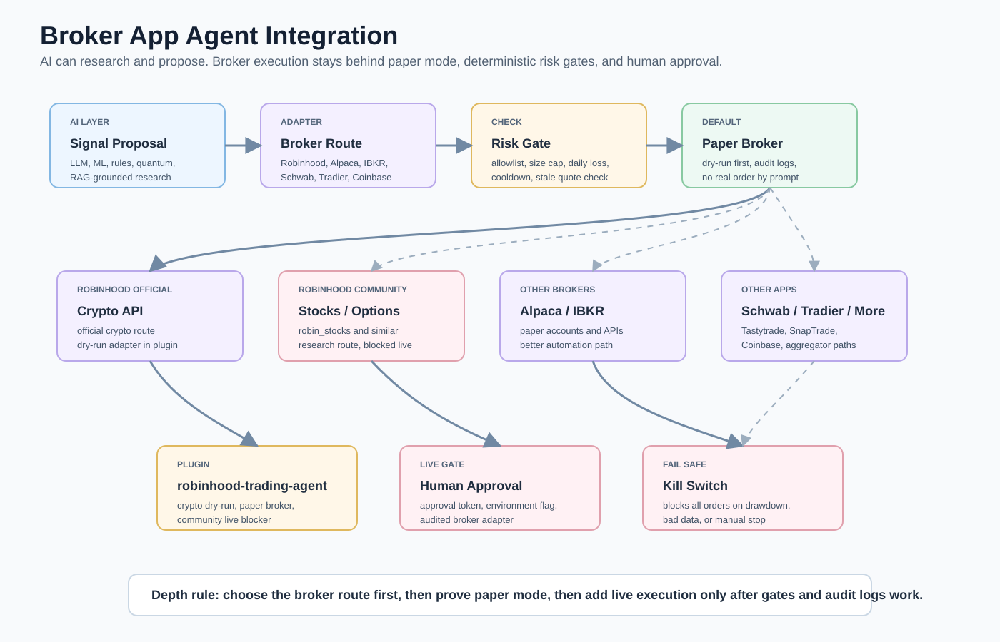

# Broker App Integrations
> **Freshness note.** Some repos referenced below were removed from the catalog for being
> unmaintained (18+ months without a commit) or missing. See the removals table in
> [docs/REPO-HEALTH.md](REPO-HEALTH.md#removed--unmaintained-or-missing) before relying on
> anything here. Replacements are listed there where a maintained successor exists.

This guide shows how to connect AI agents to Robinhood-style broker apps and broker APIs for research, day trading, investing, and portfolio workflows. It is engineering guidance, not financial advice. The default should be research or paper trading.



Read this diagram as a safety pipeline. AI can propose and explain trades, but broker adapters sit behind deterministic limits, paper mode, audit logs, human approval, and a kill switch. The official Robinhood Crypto route is separated from unofficial Robinhood stock/options libraries on purpose.

## Core Rule

```text
AI proposes
  -> deterministic risk gate checks
  -> paper broker logs
  -> human approves
  -> live broker adapter may execute
```

No prompt should directly bypass broker permissions, risk limits, paper mode, or the kill switch.

## Robinhood Implementation Notes

Robinhood has an official Crypto Trading API. Stock/options automation is usually done through community libraries, which may be brittle or violate changing platform assumptions. Treat unofficial libraries as research-only unless you have reviewed their current behavior and terms.

| Route | Use it when | Default |
| --- | --- | --- |
| [Robinhood Agentic Trading](https://robinhood.com/us/en/support/articles/agentic-trading/) | You want Robinhood's agent-oriented trading/MCP route where it is available. | Review official terms, OAuth, availability, risk controls, and approval gates first. |
| [Robinhood Crypto API docs](https://docs.robinhood.com/crypto/trading/) | You want official Robinhood crypto trading API behavior. | Build a crypto-only adapter with API keys and risk gates. |
| [jmfernandes/robin_stocks](https://github.com/jmfernandes/robin_stocks) | You want a Python community library for Robinhood account/market interactions. | Research, portfolio inspection, paper-mode wrapper first. |
| [robinhood-unofficial/pyrh](https://github.com/robinhood-unofficial/pyrh) | You want older unofficial Robinhood API examples. | Study only. |
| [DhruvaBansal00/robin_stocks_v2](https://github.com/DhruvaBansal00/robin_stocks_v2) | You want another Robinhood community fork/example. | Study only. |
| [hakantekgul/ML_Automated_Trading_Robinhood](https://github.com/hakantekgul/ML_Automated_Trading_Robinhood) | You want ML automated Robinhood examples. | Research only. |
| [sanko/robinhood](https://github.com/sanko/robinhood) | You want another community Robinhood client to inspect. | Study only. |
| [plugins/robinhood-trading-agent](../plugins/robinhood-trading-agent/README.md) | You want this repo's safe starter plugin. | Paper/research default; live blocked. |

## Other Apps Like Robinhood

| App/API | Repos | Use it when |
| --- | --- | --- |
| Alpaca | [alpacahq/alpaca-py](https://github.com/alpacahq/alpaca-py), [alpacahq/alpaca-mcp-server](https://github.com/alpacahq/alpaca-mcp-server) | You want paper trading, equities, crypto, and broker APIs designed for automation. |
| Interactive Brokers | [ib-api-reloaded/ib_async](https://github.com/ib-api-reloaded/ib_async), [ib-api-reloaded/ib_async](https://github.com/ib-api-reloaded/ib_async) | You want a powerful broker API with broad market access. |
| Schwab | [tylerebowers/Schwabdev](https://github.com/tylerebowers/Schwabdev), [alexgolec/schwab-py](https://github.com/alexgolec/schwab-py), [itsjafer/schwab-api](https://github.com/itsjafer/schwab-api) | You want Schwab API experiments and clients. |
| Tradier | [thammo4/uvatradier](https://github.com/thammo4/uvatradier), [sargun/tradier](https://github.com/sargun/tradier), [timpalpant/go-tradier](https://github.com/timpalpant/go-tradier) | You want stocks/options trading API examples. |
| Tastytrade | [tastytrade/tastytrade-api-js](https://github.com/tastytrade/tastytrade-api-js), [tastytrade/tastytrade-sdk-python](https://github.com/tastytrade/tastytrade-sdk-python), [tastyware/tastytrade-cli](https://github.com/tastyware/tastytrade-cli) | You want options-focused trading API tooling. |
| SnapTrade-style aggregator | [passiv/snaptrade-sdks](https://github.com/passiv/snaptrade-sdks), [passiv/snaptrade-cli](https://github.com/passiv/snaptrade-cli), [passiv/snaptrade-react](https://github.com/passiv/snaptrade-react) | You want one app to connect multiple brokerage accounts through an aggregator model. |
| Coinbase | [coinbase/coinbase-advanced-py](https://github.com/coinbase/coinbase-advanced-py), [coinbase/cdp-sdk-python](https://github.com/coinbase/cdp-sdk-python) | You want crypto trading APIs with official SDKs. |

## Broker Agent Architecture

```text
LLM / ML / quantum research
  -> signal proposal
  -> broker adapter interface
  -> deterministic risk gate
  -> paper broker
  -> audit log
  -> human approval token
  -> live broker adapter
```

## Required Limiters

| Limiter | Why |
| --- | --- |
| Paper mode by default | Prevents accidental live orders. |
| Asset allowlist | Stops agents from trading random symbols. |
| Asset-type allowlist | Separates stocks, options, crypto, and ETFs. |
| Max order value | Caps single-trade blast radius. |
| Max position percent | Prevents overconcentration. |
| Max orders per day | Blocks runaway loops. |
| Daily loss limit | Stops trading after drawdown. |
| Cooldown window | Prevents rapid repeated orders. |
| Stale quote check | Blocks decisions based on old data. |
| Human approval token | Forces explicit review for live execution. |
| Kill switch | Stops everything immediately. |
| Audit log | Preserves proposal, risk result, source data, and approval. |

## Implementation Steps

1. Pick broker route: Robinhood Agentic Trading, Robinhood Crypto, community Robinhood, Alpaca, IBKR, Schwab, Tradier, Tastytrade, SnapTrade, or Coinbase.
2. Start with the [autonomous day-trading plugin](../plugins/autonomous-day-trading-agent/README.md), the [Robinhood trading agent plugin](../plugins/robinhood-trading-agent/README.md), or adapt their broker interfaces.
3. Keep `paper_trading_only` true.
4. Add credentials through environment variables, never committed files.
5. Add a paper broker or sandbox adapter.
6. Add risk limits and an audit log.
7. Add a single AI signal source.
8. Backtest and paper trade.
9. Add human approval.
10. Only then consider a live broker adapter.

## Per-Broker Setup CLI One-Liners

Each block installs the Python SDK, sets credentials as environment variables, and runs a read-only smoke test. **Never hard-code credentials in scripts or committed files.**

### Alpaca (Recommended First Route — Paper Trading)

PowerShell:

```powershell
pip install alpaca-py; $env:APCA_API_KEY_ID = Read-Host "Alpaca paper key ID"; $env:APCA_API_SECRET_KEY = Read-Host "Alpaca paper secret key"; python -c "from alpaca.trading.client import TradingClient; c = TradingClient('$env:APCA_API_KEY_ID','$env:APCA_API_SECRET_KEY',paper=True); print(c.get_account())"
```

WSL/Bash:

```bash
pip install alpaca-py && read -rp "Alpaca paper key ID: " key && read -rsp "Alpaca paper secret: " secret && python3 -c "from alpaca.trading.client import TradingClient; c=TradingClient('$key','$secret',paper=True); print(c.get_account())"
```

Alpaca MCP server (paper mode, Docker):

```bash
docker run -i --rm -e ALPACA_API_KEY_ID="$APCA_API_KEY_ID" -e ALPACA_API_SECRET_KEY="$APCA_API_SECRET_KEY" -e ALPACA_PAPER=true ghcr.io/alpacahq/alpaca-mcp-server
```

### Robinhood Crypto (Official API)

PowerShell:

```powershell
pip install requests cryptography; $env:RH_API_KEY = Read-Host "Robinhood API key"; $env:RH_PRIVATE_KEY = Read-Host "Robinhood private key (base64)"; python -c "import os; print('Credentials set. Use the Robinhood Crypto REST API with these keys.')"
```

See official docs: [docs.robinhood.com/crypto/trading](https://docs.robinhood.com/crypto/trading/)

### Robinhood Stocks/Options (Community Library — Research Only)

```powershell
pip install robin_stocks; $env:RH_USER = Read-Host "Robinhood username"; $env:RH_PASS = Read-Host -AsSecureString "Robinhood password"; python -c "import robin_stocks.robinhood as r; r.login('$env:RH_USER','$env:RH_PASS'); print(r.load_portfolio_profile())"
```

Note: Community library — treat as research only. Never automate live orders through this route.

### Interactive Brokers (IBKR)

```powershell
pip install ib_async; python -c "from ib_async import IB; ib = IB(); ib.connect('127.0.0.1', 7497, clientId=1); print(ib.accountValues()[:3]); ib.disconnect()"
```

Requires TWS or IB Gateway running locally on port 7497 (paper) or 7496 (live). Keep paper port until tested.

### Schwab

```powershell
pip install schwabdev; $env:SCHWAB_APP_KEY = Read-Host "Schwab app key"; $env:SCHWAB_APP_SECRET = Read-Host "Schwab app secret"; python -c "import schwabdev; c = schwabdev.Client('$env:SCHWAB_APP_KEY','$env:SCHWAB_APP_SECRET'); print(c.account_details_all())"
```

### Tradier

```powershell
pip install requests; $env:TRADIER_TOKEN = Read-Host "Tradier sandbox token"; python -c "import requests, os; r = requests.get('https://sandbox.tradier.com/v1/user/profile', headers={'Authorization': f'Bearer {os.environ[chr(84)+chr(82)+chr(65)+chr(68)+chr(73)+chr(69)+chr(82)+chr(95)+chr(84)+chr(79)+chr(75)+chr(69)+chr(78)]}', 'Accept': 'application/json'}}).json(); print(r)"
```

Simpler one-liner using uvatradier:

```bash
pip install uvatradier && python3 -c "from uvatradier import Tradier; t = Tradier('SANDBOX_TOKEN', live=False); print(t.account.get_account_balance())"
```

### Tastytrade

```powershell
pip install tastytrade; $env:TT_USER = Read-Host "Tastytrade username"; $env:TT_PASS = Read-Host "Tastytrade password"; python -c "from tastytrade import Session; s = Session('$env:TT_USER','$env:TT_PASS'); print(s.get_customer())"
```

CLI (tastyware):

```bash
pip install tastytrade-cli && tastytrade --username "$TT_USER" --password "$TT_PASS" accounts
```

### SnapTrade (Multi-Broker Aggregator)

```bash
pip install snaptrade-python-sdk && python3 -c "from snaptrade.api_client import ApiClient; from snaptrade.configuration import Configuration; cfg = Configuration(); cfg.api_key['clientId']='YOUR_CLIENT_ID'; cfg.api_key['consumerKey']='YOUR_CONSUMER_KEY'; print('SnapTrade SDK ready')"
```

### Coinbase Advanced Trade

```powershell
pip install coinbase-advanced-py; $env:CB_API_KEY = Read-Host "Coinbase API key name"; $env:CB_API_SECRET = Read-Host "Coinbase private key"; python -c "from coinbase.rest import RESTClient; c = RESTClient(api_key='$env:CB_API_KEY', api_secret='$env:CB_API_SECRET'); print(c.get_accounts())"
```

## One-Liners

Clone broker integration repos, PowerShell:

```powershell
$MasterRepo = (Get-Location).Path  # run from repo root; $LanePath = Read-Host "Folder where broker integration repos should be cloned"; New-Item -ItemType Directory -Force $LanePath | Out-Null; Get-Content (Join-Path $MasterRepo "repo-lists\broker-app-integrations.txt") | Where-Object { $_ -and $_ -notmatch '^#' } | ForEach-Object { git clone "https://github.com/$_.git" (Join-Path $LanePath ($_ -replace '/','-')) }
```

Install the Robinhood trading plugin scaffold:

```powershell
$PluginPath = Read-Host "Path to plugins\robinhood-trading-agent"; Set-Location $PluginPath; python -m venv .venv; .\.venv\Scripts\Activate.ps1; python -m pip install --upgrade pip; python -m pip install -e .; robinhood-trading-agent smoke-test --risk risk_limits.example.json
```

WSL/Bash:

```bash
read -rp "Path to plugins/robinhood-trading-agent: " plugin_path; cd "$plugin_path"; python3 -m venv .venv && source .venv/bin/activate && python -m pip install --upgrade pip && python -m pip install -e . && robinhood-trading-agent smoke-test --risk risk_limits.example.json
```
