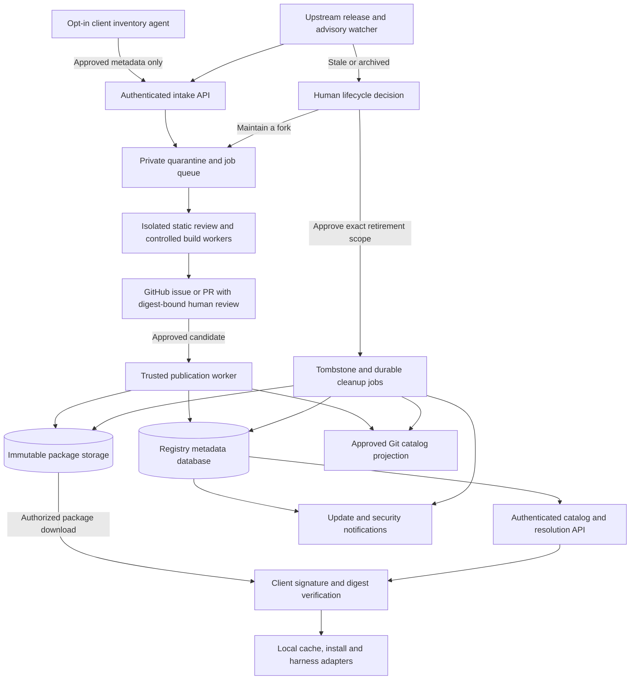

# Managed capability registry: proposal

The [2026-09-14 database and indexing supplement](registry-plan-2026-09-14/registry-architecture.md)
adds MongoDB/PostgreSQL query plans, consent and rollout gates. Matching
[PDF](registry-plan-2026-09-14/registry-architecture.pdf) and
[architecture diagram](registry-plan-2026-09-14/registry-architecture.svg) are
available. These remain design artifacts, not a deployed database service.
The supplement's Markdown and SVG retain the original export's CRLF bytes under
two narrowly scoped Git attributes so their recorded exact-byte hashes remain
valid after checkout. The PDF is unchanged; other repository text keeps the
normal LF policy.

Status: architecture for Charles to review, not a deployed service. No database,
GitHub App, client watcher, telemetry upload, automatic update or deletion is
enabled by this document. The existing [MongoDB catalog plan](MONGODB-PLAN.md)
is a smaller, separate offline catalog import. It is not already this registry.

## Decision

The idea is viable: distribute versioned skills, agents, tools, plugins and MCP
connectors, review their provenance and security, watch upstream changes, notify
users, and require human approval for retirement or managed adoption.

Use a metadata database plus immutable package storage, not one database full of
mutable installations. Keep authored source, packaging recipes and policy in Git.
Do not move the only copy of capability definitions out of version control.

For this expanded multi-user service, the recommendation is PostgreSQL with
JSONB metadata and object storage for archives. Versions, dependencies, tenant
access, approvals and installation records are naturally related. JSONB can hold
varying manifests and supports indexing. This is a design recommendation, not a
claim that MongoDB cannot implement the workflow. JSONB does not preserve JSON
formatting or duplicate keys, so exact package and definition bytes belong in
the artifact, not a reconstructed JSONB document.
[PostgreSQL JSON documentation](https://www.postgresql.org/docs/current/datatype-json.html).

MongoDB plus the same object storage is also viable and reuses the current
catalog importer. Do not operate both databases in the first version. MongoDB
has a 16 MiB document limit and GridFS for larger files; the proposed separation
is an operational choice, not a claim that MongoDB cannot store files.
[MongoDB GridFS](https://www.mongodb.com/docs/manual/core/gridfs/).

## The plan as first asked, and where it breaks

Asked 2026-09-11: store every skill, tool, plugin and MCP server in MongoDB or
PostgreSQL as packages; let GitHub bots watch upstream releases, update the
packages and tell users who are behind; send stale or archived entries to a
GitHub issue for keep, adopt or delete, deleting from storage too; and have a
monitor send every new capability a user adopts to the repo for a safety review.

Possible: yes. Works as written: no. Works with these changes: yes.

| Step as asked | What breaks | Change |
| --- | --- | --- |
| Packages live in the database | The only copy loses diffs, history and review; bytes do not belong in rows; a hosted MCP server has nothing to package | Git stays the source, object storage holds bytes by sha256, the database holds metadata and lifecycle state; hosted MCP is a reviewed connector descriptor |
| Bots update packages on each release | One compromised upstream account ships malware to every user under our name; many skill repos never tag releases | Detect automatically, publish only after scan and owner approval of the exact digest; watch file hashes as `scripts/skill_upstreams.py` does; notify by default |
| Tell users who is behind | Requires knowing every user's installs, which is telemetry | The client pulls a signed index and compares its own lockfile |
| Stale or archived: issue, then adopt or delete | Quiet is not dead; a delete cannot reach users' copies, Git history or backups | Tombstone first, notify, purge after retention; approval binds to the exact digests |
| A monitor sends users' new capabilities to the repo | A skill has no process and cannot monitor; users' files in a repo publish private work and possible malware | An opt-in local CLI and hook; metadata first, content only with separate consent, into private quarantine |
| Scan, and add whatever is clean | No scan proves harmless; skill risk is plain-language prompt injection; SQL injection is a flaw in our API, not something Markdown carries; republishing needs a licence | Scan output is evidence for a person; parameterized queries; licence check before republishing |

Phase 0 of this is already running without a database: the `repo-lists/`
catalog, `catalog-guardian.yml` with the owner-only `APPROVE CATALOG
MAINTENANCE` phrase and the SHA-bound `owner-approval.yml`, `watch-sources.yml`
for the skill aggregator, and `skill-upstreams.yml` pinning the sha256 of every
skill adapted from upstream. The database earns its place when other people
install from us; until then Git and Actions are the registry.

## Architecture

The ordinary website never receives database credentials, registry signing keys
or private package inventories. GitHub is the review interface and source host,
not the destination for unreviewed user files or malware specimens.

## Ownership and boundaries

| Component | Owns | Depends on; changes when |
| --- | --- | --- |
| Local agent and adapters | User consent, local discovery scope, installation receipts and cache | Registry API; supported client interfaces change |
| Intake service | Candidate identities, submission consent and quarantine admission | Auth and bounded fetcher; supported submission formats change |
| Review workers | Reproducible scan/build evidence for exact bytes | Quarantine objects and reviewed scanner images; security policy changes |
| Registry service | Package lifecycle, immutable version records, approvals, channels and durable jobs | Verified review evidence and artifact digests; publication/lifecycle rules change |
| Artifact storage | Exact immutable package bytes keyed by digest | Publication and cleanup identities; storage implementation changes |
| GitHub integration | Sanitized review presentation and approved catalog projection | Registry events and GitHub API; review integration changes |
| Client resolver | Authorized, compatible, non-revoked version selection | Registry state; client/runtime compatibility rules change |

Git owns authored source and policy revisions. The registry database owns
publication and retirement state. Git catalog files and website indexes are
generated projections of approved registry state, not competing editable copies.
Object hashes identify the only authoritative bytes for each published artifact.

Start with one backend application and a bounded worker pool. A database-backed
job table and transactional outbox are enough initially; separate microservices,
another search database and a distributed event platform are not prerequisites.

## What is stored

| Location | Data |
| --- | --- |
| Metadata database | Stable namespace/package ID, kind/family/subcategory, descriptions, upstream URL and exact commit, version, artifact digest/size/location, license and notices, dependencies, permissions, client/OS/architecture compatibility, review status, source health, channels and revocations |
| Private operational tables or collections | Consent, tenant access, minimal installation/version receipts, scan jobs and reports, approval identity and scope, audit events, tombstones and retryable publication/deletion jobs |
| Immutable artifact storage | Complete permitted skill/agent definitions, scripts, manifests, lockfiles, notices and redistribution-approved archives; containers may use an OCI container registry |
| Git | Owned source, packaging recipes, policies, approved manifest changes and sanitized review history |
| Secret manager | Backend credentials, signing credentials and scoped GitHub integration credentials, never package manifests or frontend JavaScript |

Small owned definitions may also have exact full-text database copies for
authenticated inspection and search, with checksums back to the artifact. No
capability definition is shortened, substituted with a summary, or dropped to
reduce tokens. A search result is a retrieval aid, not a replacement definition.

Index stable package IDs, namespace/version, digest, kind/family/subcategory,
dependency edges, lifecycle status, and tenant/installed version. Add full-text
description search. Add vector search only if measured search needs justify it.
Indexes make those lookups efficient; they do not make a capability executable.

Do not collect prompts, transcripts, environment values, secrets, browser data,
screenshots, private file paths or entire working directories by default.
Installed-version receipts identify pseudonymous tenant/device IDs only where
the user consented. Even package names can reveal private work, so allow
local-only comparison against a signed public catalog without uploading inventory.

Hosted services cannot necessarily be repackaged. A remote MCP service usually
needs a reviewed connector descriptor, endpoint identity, permission/tool schema
and credential references, not a copy of the service. Proprietary plugins and
unlicensed code remain reference-only unless redistribution rights are verified.
Public availability on GitHub is not permission to redistribute arbitrary code.
[GitHub licensing guidance](https://docs.github.com/en/repositories/managing-your-repositorys-settings-and-features/customizing-your-repository/licensing-a-repository).

## Intake and publication

1. The user enables specific discovery adapters and roots. A real local service
   or CLI observes supported installs/configuration changes; a skill alone is not
   an always-running watcher and cannot observe every hosted chat product.
2. Send only approved source coordinates, version and digest first. Unknown
   private/custom content requires separate upload consent and ownership review.
   Upload it to private quarantine, not the main repo or a public issue.
3. Resolve canonical source identity and an exact immutable commit/artifact.
   Limit download size, unpacked size, time and file count. Reject path traversal,
   unsafe links and archive bombs. Restrict schemes and destinations, block
   private/metadata IP ranges and validate every redirect to prevent SSRF.
4. Run static provenance, license, malware, secret, dependency/advisory, hidden
   Unicode, injection, install-hook and workflow checks. Flag suspicious invisible
   text for review; legitimate language/emoji sequences are not automatically
   malware. Preserve original bytes and report scanner coverage and errors.
5. Do not execute candidates during initial intake. If later testing needs code
   execution, use disposable isolated workers without production secrets, with
   explicit network policy and resource limits. Never run candidate installers
   on Charles's workstation or a persistent privileged runner.
6. Scan both source and the final artifact, including bundled dependencies. Record
   hashes, scanner/rule versions, license results, a software bill of materials
   and provenance. A missing/failed scanner means incomplete review, not pass.
7. Human review binds approval to package ID, source commit, artifact digest,
   permissions and policy revision. Editing any bound item invalidates approval.
   The publication identity is separate from the untrusted build worker.
8. Publish an immutable artifact and approved version record. Clients verify the
   trusted signer, digest, supported platform, dependency lock and revocation
   state before installing. An interrupted install must leave the previous
   working version or a recoverable state.

No finite scan proves software harmless. Provenance demonstrates origin and
build identity, not freedom from vulnerabilities.
[GitHub artifact attestations](https://docs.github.com/en/actions/concepts/security/artifact-attestations).
Treat AI-assisted reviewers as advisory: they cannot authorize publication or
execute instructions from scanned files. Sanitize rendered reports and tool
descriptions; scan text remains untrusted data after it is stored.

License review must distinguish mirroring a package from operating its functionality
for other users, and record separate licenses for a skill and its engine. For example,
the Caveman skill's pinned [MIT LICENSE scope](https://raw.githubusercontent.com/JuliusBrussee/caveman/15581d14007fd01fb3f132016741962f34936ca2/LICENSE)
does not extend to its engine-linked directories. The separate caveman-browse
[pinned LICENSE](https://raw.githubusercontent.com/JuliusBrussee/caveman-browse/d3d9eb4217f50712584a2165a81e7f5ca7e48f79/LICENSE)
is BSL-1.1, not MIT. Its text permits copying, modification, redistribution and
non-production use, with the license conspicuously displayed on every copy;
mirrored or redistributed copies remain subject to those terms. Its Additional
Use Grant permits production use for internal evaluation, local development,
CI testing, integration, and self-hosted use for one's own first-party traffic.
Offering the work or its functionality to third parties as a hosted, managed or
embedded service requires a separate commercial license. The stated Change Date
is **2030-06-21** and Change License is **Apache License, Version 2.0**; the text
also provides the earlier fourth-anniversary trigger for a specific version.
Do not infer that operating a package registry grants permission to operate a
restricted engine as a service. Record and review the proposed use separately.
The benchmark could not obtain a verified caveman-browse executable; its metadata
and licensing audit is not malware or CVE clearance. GitHub's inferred license
metadata does not supersede these pinned license files.

Use parameterized SQL and validated, allowlisted NoSQL query construction in
the service itself. Scanning a package for injection is not a substitute for
protecting our database API. Enforce tenant authorization on every read/write.
[OWASP SQL injection prevention](https://cheatsheetseries.owasp.org/cheatsheets/SQL_Injection_Prevention_Cheat_Sheet.html),
[OWASP NoSQL security](https://cheatsheetseries.owasp.org/cheatsheets/NoSQL_Security_Cheat_Sheet.html).

## Updates and notifications

Use authenticated GitHub App webhooks where the app has access. For arbitrary
upstream repositories, use rate-limited conditional polling; creating a repo
webhook requires owner/admin access. Verify webhook signatures, deduplicate event
IDs, retry with backoff and periodically reconcile missed events.
[GitHub webhook permissions](https://docs.github.com/en/webhooks/using-webhooks/creating-webhooks),
[GitHub API best practices](https://docs.github.com/en/rest/using-the-rest-api/best-practices-for-using-the-rest-api),
[Webhook validation](https://docs.github.com/en/webhooks/using-webhooks/validating-webhook-deliveries).

Watch release assets, commits and security advisories, not just version labels.
A moved tag or changed artifact digest is a new review candidate. Reassess
already published versions when new advisories or scanner rules arrive.

Every candidate update passes intake again. Distinguish `upstream available`,
`approved update`, `incompatible`, `unsupported` and `revoked` in the UI. Compare
against the newest approved version compatible with that client's lock and
channel, not merely the numerically newest upstream release.

Notify by default. Automatic installation is a separate opt-in policy, limited
to pre-approved risk classes after compatibility tests and staged rollout.
New permissions, major changes and license changes require fresh approval.
Keep rollback artifacts unless the version has been revoked. A locally modified
installation is not overwritten silently; show the diff or install side by side.

Cache signed approved packages for availability, but give revocation/catalog
metadata an expiry. On expired security metadata, block new installs and updates;
the tenant explicitly decides whether existing offline execution may continue.
Do not promise an offline machine can receive immediate revocation.

## Stale projects, forks and human-approved removal

Inactivity is a review signal, not proof of abandonment. Check archive reason,
release cadence, vulnerabilities, current users, dependency impact, alternatives,
license rights, tests and realistic maintenance cost. Adopt in house only with a
named owner, patch/support budget, test/build coverage and an exit plan. A fork
gets a new namespace and recorded upstream lineage; do not impersonate upstream.

Removal is not one `DELETE` statement:

1. Open or refresh one review issue with exact IDs/digests, reasons, reverse
   dependencies, affected installs, replacement options and proposed scope.
2. Verify the approver's GitHub identity and current authority. Bind approval to
   that issue's exact deletion plan digest; a label or arbitrary comment is not
   authorization. New scope requires new approval.
3. Record a tombstone and stop new installs once the approved retirement takes
   effect. Notify affected users and provide migration instructions.
4. Commit the lifecycle change and cleanup jobs together in the registry's
   transaction. Idempotent workers update the Git catalog, database search
   projections, artifact storage and caches, retrying partial failures. Record a
   receipt per target and verify convergence before closing the issue.
5. Purge only approved, unreferenced artifact versions after the chosen retention
   or hold period. Preserve a minimal audit/tombstone record so a watcher cannot
   silently reimport the same rejected package.

Git history, storage backups and users' downloaded copies are separate retention
domains. Deleting the live catalog cannot instantly erase them. State the backup
expiry and any required history-remediation process. Do not delete a user's local
installation without their consent or an explicit managed-device policy.

An emergency response policy should be approved in advance: a confirmed malicious
digest can then be blocked from new distribution immediately while a human
reviews. That is a temporary security quarantine, not permission for a bot to
permanently delete capabilities. Without that policy, escalate for approval.

## Delivery phases and acceptance gates

1. **Private registry pilot.** Choose one database, object storage and retention
   policy. Package only owned/approved capabilities; implement identity, exact
   version manifests, authenticated search/download and checksum verification.
   Gate: round-trip full definitions byte-for-byte and reject digest mismatch.
2. **Review pipeline.** Add private quarantine, bounded workers, evidence reports,
   GitHub approvals and signed publication. Gate: no candidate executes during
   intake; scanner failure and approval/digest mismatch block publication.
3. **Upstream maintenance.** Add deduplicated release/advisory watching, compatible
   version comparisons, notifications and rollback. Gate: duplicate events create
   one candidate, permission changes require review, and rollback is exercised.
4. **Opt-in client monitoring.** Ship the local agent plus a discoverable control
   skill/MCP interface and explicit supported-client matrix. Integrate the
   existing no-slash harness adapters. Gate: local-only mode makes no inventory
   upload, private paths/secrets never enter submissions, and unknown clients are
   reported unsupported rather than silently claimed covered.
5. **Lifecycle operations.** Add adoption dossiers, precise retirement approval,
   tombstones and cleanup reconciliation. Gate: dependency impact is visible,
   retries cannot widen deletion scope, partial failures recover, and restoration
   from backup replays tombstones before enabling downloads.

Size the service using observed package sizes, download volume, scanner CPU time,
retention and human review load. Database capacity alone is not the operating cost.
Do not commit to fleet-wide automatic upgrades until those gates and key-rotation,
backup-restore and incident-response drills have passed.
