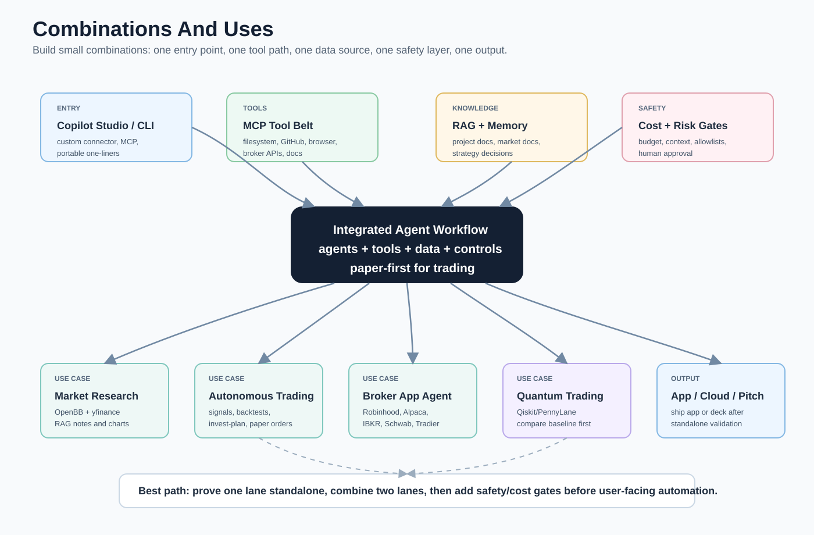

# Integration Flows

This file shows how the pieces fit together. Pitch and hackathon tools are standalone support, not part of the main runtime stack.

Each lane can also run standalone. Use [Standalone usage](STANDALONE-USAGE.md) when you want to try one lane on a different computer before connecting it to the full stack.



Read this diagram from the entry points into the shared core. CLI, VS Code, Copilot Studio, apps, and automations can all reach the same agent runtime, but every specialist lane should pass through MCP boundaries, RAG/memory, risk gates, and cost controls before it affects files, cloud resources, broker APIs, or quantum jobs.

## Core Agent Flow

```text
User
  -> CLI, VS Code, Copilot Studio, mobile app, web app, or automation
  -> agent framework
  -> MCP servers and normal APIs
  -> RAG, memory, context compression, and cost controls
  -> local repo, GitHub, cloud service, database, or app
```

Standalone version:

```text
Pick one agent framework
  -> clone only that repo or list
  -> run its sample
  -> add tools, RAG, and memory later
```

## Microsoft Copilot Studio Flow

```text
Copilot Studio topic or agent
  -> custom connector, OpenAPI action, or MCP connector
  -> API bridge or MCP server
  -> local/hosted agent, RAG service, trading research service, or quantum sidecar
  -> response back to Copilot Studio
```

Good when the audience needs a business-facing agent and the heavy logic should live in code.

Standalone version: build one REST action or one MCP connector against a tiny API first, then connect it to other agents later.

## MCP Tool Flow

```text
Agent host
  -> MCP client
  -> MCP server
  -> approved tool boundary
  -> filesystem, GitHub, browser, database, docs, cloud cost API, or market data API
```

Cost rule: expose fewer MCP tools by default. Each extra tool and schema increases context size, latency, and token cost.

Standalone version: run one MCP server against one chosen folder or API before adding it to an agent.

## RAG And Memory Flow

```text
Project files or market docs
  -> chunk/index pipeline
  -> vector store or graph store
  -> retrieval layer
  -> agent answer with citations or source pointers
  -> memory stores durable decisions
```

Use RAG for facts. Use memory for decisions, preferences, and durable project state.

Standalone version: index one folder and ask questions before wiring retrieval into a larger agent.

## Trading And Market Analysis Flow

```text
Market data, filings, news, watchlists
  -> OpenBB, yfinance, broker API, or data vendor
  -> RAG and analysis agent
  -> backtest or paper-trade simulator
  -> risk review
  -> human decision
```

Do not skip the risk review. This repo is for research and engineering structure, not financial advice.

Standalone version: use public/sample data, charts, and paper trading before any broker connection.

## Autonomous Day-Trading Flow

```text
market data and account state
  -> strategy signal engine
  -> backtest and baseline review
  -> deterministic risk gates
  -> paper broker
  -> audit log
  -> human approval
  -> optional live broker adapter
```

Default version: use [plugins/autonomous-day-trading-agent](../plugins/autonomous-day-trading-agent/README.md), keep paper trading on, and do not claim the agent will make money. The agent can automate signals, paper orders, and invest-plan proposals; live execution needs an audited broker adapter.

Standalone version: run `smoke-test`, `backtest`, `strategy-signal`, `paper-order`, and `invest-plan` on local data before connecting the lane to MCP, Copilot Studio, or a broker route.

## Quantum Sidecar Flow

```text
Classical agent or finance workflow
  -> choose optimization/QML experiment
  -> Qiskit, PennyLane, Cirq, Q#, Braket, D-Wave, or CUDA-Q
  -> simulator first
  -> optional quantum hardware run
  -> compare against classical baseline
```

Quantum belongs beside the core flow, not inside every workflow. Use it where optimization, sampling, chemistry, finance research, or quantum machine learning is the actual experiment.

Standalone version: run local simulator experiments before adding API/MCP or paid hardware access.

## Quantum Trading Agent Flow

```text
market data
  -> ML/LLM research module
  -> classical baseline
  -> quantum optimizer or QML experiment
  -> deterministic risk gates
  -> paper broker
  -> human approval
  -> optional live broker adapter
```

Default version: use [plugins/quantum-trading-agent](../plugins/quantum-trading-agent/README.md), keep paper trading on, and replace the optimizer/broker only after tests and risk gates are audited.

## Broker App Agent Flow

```text
LLM, ML, or quantum signal
  -> broker-specific adapter
  -> deterministic risk gate
  -> paper broker
  -> audit log
  -> human approval
  -> optional live broker adapter
```

Default version: use [plugins/robinhood-trading-agent](../plugins/robinhood-trading-agent/README.md), start with Robinhood Crypto dry-run or paper mode, and treat community Robinhood stock/options libraries as research-only until reviewed.

## Cost Reduction Flow

```text
Agent request
  -> tool allowlist
  -> retrieval filter
  -> token compression or summary
  -> cheaper/local model where acceptable
  -> budget and usage logs
  -> cloud/API cost checks
```

Use cost controls before scaling a workflow across many repos or agents.

Standalone version: run one cost tool against one repo, cloud account, Kubernetes cluster, or prompt sample.

## Standalone Pitch And Hackathon Flow

```text
Project summaries and screenshots
  -> Slidev, Marpit, pitch-deck, or hackathon checklist
  -> standalone deck, README, or demo plan
```

Pitch/hackathon tools can consume outputs from the main stack, but they do not run the agent system.
