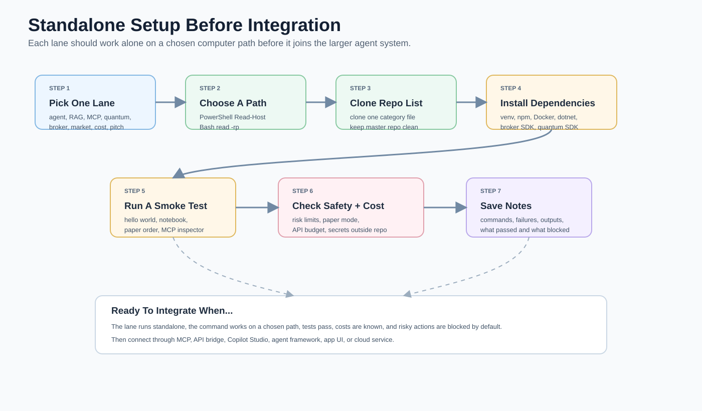

# Standalone Usage

Every lane in this repo can be used by itself. The integration docs show how to combine the lanes, but you do not need the full stack to get value.

Replace `REVIEWED_VERSION` with an exact package release you inspected; never use `latest` or automatic yes.



Read this diagram as the simplest repeatable setup path: pick one lane, choose a local folder for that computer, clone only the matching repo list, run one smoke test, then connect it to the larger stack after it works by itself.

## Universal Standalone Pattern

1. Pick one lane.
2. Choose a folder on that computer.
3. Clone only the repo list for that lane.
4. Install only that lane's dependencies.
5. Run a sample, notebook, CLI, or docs read-through.
6. Save notes in that lane's folder.
7. Connect it to the larger agent stack only after it works standalone.

PowerShell folder prompt:

```powershell
$LanePath = Read-Host "Where should this standalone lane live?"; New-Item -ItemType Directory -Force $LanePath | Out-Null; Set-Location $LanePath
```

WSL/Bash folder prompt:

```bash
read -rp "Where should this standalone lane live? " lane_path; mkdir -p "$lane_path"; cd "$lane_path"
```

## Standalone Lanes

| Lane | Standalone goal | Repo list |
| --- | --- | --- |
| Agent frameworks | Try one agent runtime or sample without RAG/MCP extras. | `agent-frameworks.txt` |
| RAG/knowledge/memory | Index a small docs folder and ask questions. | `rag-knowledge-memory.txt` |
| Context/token management | Compress prompts or test context controls on sample logs. | `context-token-management.txt` |
| MCP servers | Run one MCP server against one safe folder or API. | `mcp-servers-extended.txt` |
| Copilot Studio | Build one REST or MCP action bridge. | `copilot-studio-integration.txt` |
| App/mobile | Start one Expo/template app. | `app-mobile-structure.txt` |
| Cloud/Aspire | Run one sample locally. | `cloud-aspire-samples.txt` |
| Autonomous day trading | Generate signals, backtest, invest-plan, and paper-trade without live orders. | `autonomous-day-trading-agents.txt` |
| Finance/trading | Analyze market data or paper-trade in a lab. | `finance-trading-market.txt` |
| Quantum | Run simulator-first experiments. | `quantum-computing.txt` |
| Quantum trading | Try a risk-gated paper-trading plugin and quantum finance repos. | `quantum-finance-trading.txt` |
| Broker app integrations | Try Robinhood-style broker adapters in paper mode. | `broker-app-integrations.txt` |
| Cost reduction | Run one cost or token reduction tool. | `cost-reduction.txt` |
| Pitch/hackathon | Create a deck, demo plan, or checklist. | `hackathon-pitch-slides.txt` |

## Standalone Steps By Lane

### Agent Frameworks

1. Clone `agent-frameworks.txt` into a chosen folder.
2. Pick one framework first, such as Squad, Microsoft Agents, or Copilot CLI.
3. Run its hello-world or sample.
4. Add tools later only after the base agent runs.

PowerShell:

```powershell
$MasterRepo = (Get-Location).Path  # run from repo root; $LanePath = Read-Host "Folder for standalone agent framework repos"; New-Item -ItemType Directory -Force $LanePath | Out-Null; Get-Content (Join-Path $MasterRepo "repo-lists\agent-frameworks.txt") | Where-Object { $_ -and $_ -notmatch '^#' } | ForEach-Object { gh repo clone $_ (Join-Path $LanePath ($_ -replace '/','-')) }
```

### RAG, Knowledge, And Memory

1. Clone `rag-knowledge-memory.txt`.
2. Pick one small folder of docs.
3. Index that folder.
4. Ask questions with citations or source paths.
5. Add agent integration later.

WSL/Bash:

```bash
read -rp "Path to Master-Repo-Use: " master_repo; read -rp "Folder for standalone RAG repos: " lane_path; mkdir -p "$lane_path"; grep -vE '^(#|$)' "$master_repo/repo-lists/rag-knowledge-memory.txt" | while read -r repo; do gh repo clone "$repo" "$lane_path/${repo/\//-}"; done
```

### Context And Token Management

1. Clone `context-token-management.txt` and `cost-reduction.txt` if useful.
2. Test on sample prompts, logs, or summaries.
3. Measure before/after token size where possible.
4. Add to agent workflows only after quality stays acceptable.

### MCP Servers

1. Clone `mcp-servers-extended.txt`.
2. Start with filesystem MCP against one test folder.
3. Run the MCP inspector or your host's tool test.
4. Add GitHub, browser, docs, or cloud tools one at a time.

PowerShell:

```powershell
$AllowedPath = Read-Host "Folder the MCP server may access"; npx @modelcontextprotocol/server-filesystem@REVIEWED_VERSION $AllowedPath
```

### Copilot Studio

1. Use one OpenAPI bridge example.
2. Host a tiny API endpoint.
3. Connect it as a custom connector/action.
4. Return small structured JSON.
5. Add MCP only after the REST bridge is understood.

### App And Mobile

1. Clone app/mobile templates or run a template CLI.
2. Start the app by itself.
3. Add a single agent API endpoint later.
4. Keep mobile secrets out of the app repo.

### Cloud And Aspire

1. Clone one sample.
2. Run locally first.
3. Add Infracost or cloud budget checks before deployment.
4. Keep cloud credentials in the provider's normal secret stores.

### Finance, Trading, And Market Analysis

1. Clone `finance-trading-market.txt`.
2. Install research packages in a virtual environment.
3. Use public/sample data first.
4. Backtest or paper-trade before any broker connection.
5. Require human approval for every live action.

PowerShell:

```powershell
$LanePath = Read-Host "Folder for standalone finance lab"; New-Item -ItemType Directory -Force $LanePath | Out-Null; Set-Location $LanePath; python -m venv .venv; .\.venv\Scripts\Activate.ps1; python -m pip install --upgrade pip openbb yfinance mplfinance ta pandas numpy
```

### Autonomous Day Trading And Investing

1. Read [docs/AUTONOMOUS-DAY-TRADING.md](AUTONOMOUS-DAY-TRADING.md).
2. Install the standalone plugin.
3. Run `smoke-test`.
4. Feed CSV bars into `strategy-signal` and `backtest`.
5. Use `paper-order` or `invest-plan`.
6. Keep live orders blocked until the broker adapter and risk gates are audited.

PowerShell:

```powershell
$PluginPath = Read-Host "Path to plugins\autonomous-day-trading-agent"; Set-Location $PluginPath; python -m venv .venv; .\.venv\Scripts\Activate.ps1; python -m pip install --upgrade pip; python -m pip install -e .; autonomous-day-trading-agent smoke-test --risk risk_limits.example.json
```

WSL/Bash:

```bash
read -rp "Path to plugins/autonomous-day-trading-agent: " plugin_path; cd "$plugin_path"; python3 -m venv .venv && source .venv/bin/activate && python -m pip install --upgrade pip && python -m pip install -e . && autonomous-day-trading-agent smoke-test --risk risk_limits.example.json
```

### Quantum

1. Clone `quantum-computing.txt`.
2. Run local simulators first.
3. Compare results with classical baselines.
4. Use paid hardware/cloud only after a budget check.
5. Add MCP/API integration only after the experiment is stable.

WSL/Bash:

```bash
read -rp "Folder for standalone quantum lab: " lane_path; mkdir -p "$lane_path"; cd "$lane_path"; python3 -m venv .venv && source .venv/bin/activate && python -m pip install --upgrade pip qiskit qiskit-finance qiskit-optimization pennylane matplotlib pandas
```

### Quantum Trading

1. Read [quantum/QUANTUM-TRADING.md](../quantum/QUANTUM-TRADING.md).
2. Clone `quantum-finance-trading.txt` and `day-trading-bots.txt` into a chosen folder.
3. Install the starter plugin.
4. Run `smoke-test`, `propose`, and `paper-order`.
5. Keep live trading disabled until every risk gate is audited.

PowerShell:

```powershell
$PluginPath = Read-Host "Path to plugins\quantum-trading-agent"; Set-Location $PluginPath; python -m venv .venv; .\.venv\Scripts\Activate.ps1; python -m pip install --upgrade pip; python -m pip install -e .; quantum-trading-agent smoke-test --risk risk_limits.example.json
```

### Broker App Integrations

1. Read [docs/BROKER-APP-INTEGRATIONS.md](BROKER-APP-INTEGRATIONS.md).
2. Pick one broker route: Robinhood Crypto, Alpaca, IBKR, Schwab, Tradier, Tastytrade, SnapTrade, or Coinbase.
3. Start with the [Robinhood trading plugin](../plugins/robinhood-trading-agent/README.md).
4. Keep paper mode on.
5. Add a real broker adapter only after risk gates, approval, and audit logs work.

PowerShell:

```powershell
$PluginPath = Read-Host "Path to plugins\robinhood-trading-agent"; Set-Location $PluginPath; python -m venv .venv; .\.venv\Scripts\Activate.ps1; python -m pip install --upgrade pip; python -m pip install -e .; robinhood-trading-agent smoke-test --risk risk_limits.example.json
```

### Cost Reduction

1. Clone `cost-reduction.txt`.
2. Pick one cost target: tokens, MCP tools, cloud infra, Kubernetes, or API calls.
3. Run one tool against a sample or read-only target.
4. Add budget gates before automation.

### Pitch And Hackathon

1. Clone `hackathon-pitch-slides.txt` or start Slidev.
2. Build the deck or checklist in its own folder.
3. Pull summaries/screenshots from the core stack only as inputs.
4. Keep this lane standalone.

WSL/Bash:

```bash
read -rp "Folder for standalone deck: " deck_path; mkdir -p "$deck_path"; cd "$deck_path"; npm init slidev
```
