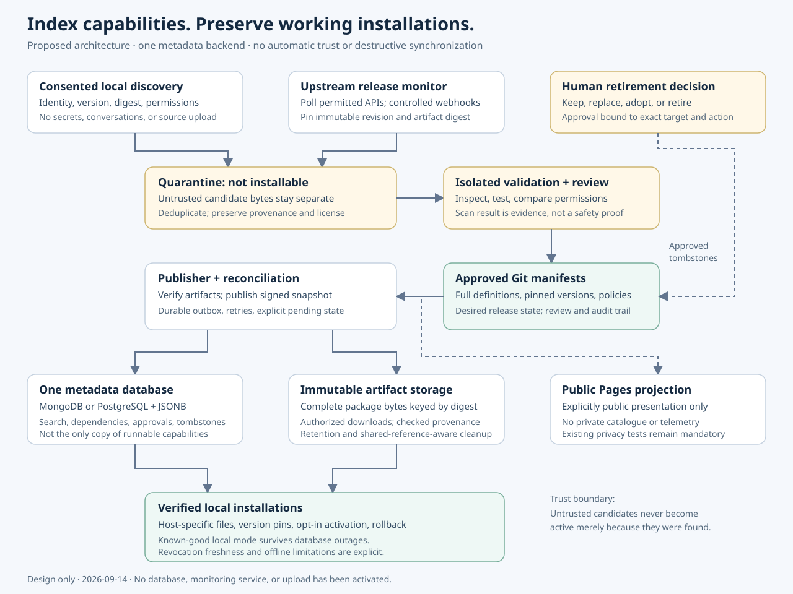

# Capability registry: safe indexing and package lifecycle

**Status:** proposed architecture, not a deployed service. Prepared 2026-09-14.

## Recommendation

Yes, a registry can index skills, agents, tools, plugins, MCP integrations, and their categories. It can also track package versions, test updates, notify users, and coordinate approved retirement.

Do **not** move the only working copy of every capability into a database. Keep the existing file-based setup runnable. A registry complements that setup; it must not become a new prerequisite for every prompt or command.

Use these separate responsibilities:

1. **Git** holds reviewed manifests, policies, source references, canonical skill definitions, and the desired release state.
2. **One metadata database** holds searchable records, version relationships, validation results, and operational lifecycle state.
3. **An artifact store** holds immutable, digest-addressed package bytes. Initially this can be appropriately access-controlled release assets rather than a new service.
4. **The client** materializes verified, pinned files in each harness's expected directories and keeps a known-good local copy.

For the proposed multi-user registry, follow the repository's existing recommendation: PostgreSQL with relational constraints plus JSONB metadata and immutable external artifacts. Preserve the optional MongoDB importer and the working local-file path. MongoDB remains a viable primary backend if its deployment, transaction, and query requirements are satisfied; the presence of an importer is not evidence of an existing live database. Choose one backend initially, not a dual-write MongoDB/PostgreSQL system.



## Existing implementation and what this plan adds

Repository inspection for this request found:

| Existing component | Verified role | What it does not prove |
| --- | --- | --- |
| `docs\CAPABILITY-REGISTRY-ARCHITECTURE.md` | Recommends PostgreSQL JSONB plus immutable artifacts, with MongoDB as an alternative; describes lifecycle phases | A registry has been provisioned or deployed |
| `scripts\load_catalog_mongo.py` | Supports offline collection/check/explain modes and an explicit load mode; validates names/documents, uses bounded connection selection and owned-key upserts | Index creation, transactional publication, or deletion governance |
| `scripts\catalog_index_spec.py` | Statically reads index declarations and their options | Actual indexes exist or query plans perform well on a server |
| `scripts\catalog-indexes.js` | Supplies proposed index declarations for separate approved execution | Permission to execute schema changes automatically |

The importer does not implicitly install dependencies or connect as a fallback: a missing URI or required driver in load mode is an explicit error. It does not drop collections, and it can acknowledge partial writes. It does not create indexes automatically.

This plan supplements, rather than replaces, the existing architecture. It makes indexing acceptance, exact-digest approvals, durable delivery, consent boundaries, tombstones, and matching PDF/Markdown delivery explicit. No database command is executed by preparing these documents.

## What “indexing” means

A package record can describe a capability without loading all its contents into every model prompt:

```json
{
  "package_id": "example.code-map",
  "scope": "private-team",
  "kinds": ["skill", "tool"],
  "categories": ["code-understanding", "dependency-analysis"],
  "supported_surfaces": ["copilot-cli", "claude-code"],
  "version": "1.2.0",
  "source_revision": "immutable revision",
  "artifact_digest": "sha256:verified-package-digest",
  "permissions": ["workspace-read"],
  "validation_state": "approved",
  "manifest_schema_version": 1
}
```

This is an illustrative manifest, not an installed package or production schema. An index on supported surface, capability kind, and approval state makes queries such as “approved code-understanding tools for Copilot CLI” efficient. A category relation allows one package to appear in several categories without duplicating the package.

The complete `SKILL.md`, source attribution, supporting files, and compatible tool executable remain available as versioned artifacts. Their definitions are not shortened by indexing. Loading relevant capabilities on demand is different from deleting content or weakening instructions.

Not everything becomes the same type of executable package:

- A skill or agent may be a manifest plus complete instruction files.
- A native tool needs platform-specific artifacts and compatible runtime requirements.
- A plugin may require a host-specific installer or extension API.
- An MCP entry may describe an external service connector. Its remote service and credentials cannot be copied into a portable package merely by indexing the connector.
- An adapted skill is a distinct maintained derivative with its own version and upstream relationship, not an unexplained substitute for the original.

## MongoDB versus PostgreSQL

| Requirement | MongoDB | PostgreSQL |
| --- | --- | --- |
| Different manifest shapes | Natural document model; validate known fields and schema versions | JSONB for variable fields, typed columns for invariant fields |
| Filtering and categories | Compound/multikey indexes chosen for actual queries | B-tree indexes, category join tables, optional JSONB indexes |
| Versions, dependencies, approvals | Explicit identity and relationship validation; unique indexes | Foreign keys, unique constraints, transactions |
| Atomic lifecycle changes | Single-document writes are atomic; multi-document transactions need an appropriate deployment | Transactional changes across related tables |
| Migration risk here | Lower if existing indexing code already works | Adds migration work if replacing a functioning MongoDB path |
| Large executable archives | Prefer external immutable artifacts | Prefer external immutable artifacts |

MongoDB transactions are available on replica sets and sharded clusters, not an assumed standalone deployment. Do not silently depend on that feature without checking the actual deployment. PostgreSQL JSONB is searchable/indexable, but it is not byte-preserving JSON storage: keep signed manifests and original bytes separately where exact formatting or duplicate-key rejection matters.

Do not choose either database to “solve SQL injection.” Safe query construction, typed inputs, allowlisted operations, and authorization remain necessary. MongoDB also has query-operator injection risks when untrusted input becomes a query object.

### Logical records

The same model can be implemented in either backend:

- **Package:** stable identity, tenant/scope, capability kinds, owner, upstream identity, permissions, and lifecycle state.
- **Version:** immutable source revision, artifact digest, manifest digest, dependencies, license evidence, host/runtime compatibility, and release date.
- **Category membership:** many-to-many classification; aliases do not create duplicate packages.
- **Capability target:** an explicit package/kind/host relationship where cross-filtering would otherwise require indexing multiple arrays.
- **Validation result:** exact candidate digest, scanner/test versions, policy version, findings, and outcome.
- **Approval:** authorized human identity, exact action and target digests, expiry, and review evidence.
- **Installation report:** only consented minimal version/digest/surface metadata, with retention rules.
- **Delivery/outbox event:** idempotency key, intended state change, attempts, and completion status.
- **Retirement/tombstone:** blocked versions, reason, approval reference, replacement guidance, and retention status.

Package identity should survive upstream repository renames. A mutable repository slug, tag, or default branch is not an immutable version identifier.

## Index plan for both backends

Index the queries the product actually needs, not every field or every byte of a package. The table below is a proposed logical target; it is not a claim that the current script already defines these exact names or that a migration has run.

| Query | MongoDB candidate | PostgreSQL candidate |
| --- | --- | --- |
| Exact package/version lookup | Unique compound index on version records: `scope, package_id, version` | Composite unique constraint or key on the same fields |
| Browse approved packages within a scope | Compound index: `scope, lifecycle_state, updated_at, package_id` | B-tree on the same filter/order fields |
| Find category members | Unique membership index: `scope, category_id, package_id` | Membership key on the same fields, with package/category foreign keys |
| Filter by capability kind and host | Scalar target records indexed by `scope, surface, kind, package_id` | A target relation with equivalent B-tree index and foreign keys |
| List approved candidate versions | Index on `scope, package_id, validation_state, approved_at` | B-tree index on the same fields; an approved-only partial index where justified |
| Process retryable delivery work | Index on `state, available_at, event_id` | B-tree or pending-only partial index on the same fields |
| Locate artifact references before cleanup | Index on `artifact_digest, reference_state` | B-tree on the same reference fields |
| Search approved names/descriptions | Optional scoped text index over allowlisted text fields | Optional GIN index over a maintained search vector, with scope authorization |
| Find a client's reported versions | Unique index on consented reports: `scope, client_id, package_id` | Composite key on the same fields |

Important design constraints:

- **Scope is an authorization boundary, not merely an index prefix.** Enforce scope and download permissions in every API operation. An index does not grant or restrict access by itself.
- **MongoDB array limits matter.** Do not blindly create one compound index over `categories[]`, `kinds[]`, and `supported_surfaces[]`. Compound multikey indexes cannot index multiple array fields in the same document. Use scalar membership/target records or individually justified indexes.
- **Version ordering needs a resolver.** Lexical tag order or newest timestamp is not a reliable substitute for semantic-version compatibility. Resolve constraints, prerelease policy, platform, runtime, and capability permissions explicitly.
- **Uniqueness should protect identity.** An artifact digest can legitimately be shared by multiple versions or packages. Do not accidentally prohibit valid sharing or let shared bytes bypass tenant authorization.
- **TTL is not a package deletion policy.** A retention index may be suitable for consented transient reports after policy approval, but it must not replace human-approved package retirement, reference checks, or audit retention.
- **Text search is optional.** Start with typed filters and categories. Add full-text indexing only for verified search requirements; vector search is not required for this design.
- **Indexes have write, storage, and memory costs.** Measure query plans and real access patterns before adding overlapping indexes.

### Index rollout

1. Review the existing static specification and map every index to a supported query and invariant.
2. Export a versioned manifest with package IDs, counts, and source/content digests.
3. Load representative approved data into a disposable test database, not production.
4. Compare records, category membership, and exact definition/artifact digests with the file baseline.
5. Evaluate execution plans and record cold/warm latency, examined documents or rows, cardinality, and index size. Report the tested database version and host resources.
6. Exercise uniqueness conflicts, concurrent updates, scope isolation, failed writes, replayed events, and rollback.
7. Obtain approval for production index creation separately from data loading. Use the database's supported online/concurrent build options where appropriate, with operational limits.
8. Switch only read-only catalogue queries first. Keep file-backed operation and a verified export available.
9. Retire an old index only after its replacement is validated and dependent queries have been checked.

No performance number is promised before measurement. For either backend, success means equivalent results and preserved behavior, not merely a successful `createIndex` or `CREATE INDEX` command.

## Intake and discovery

Discovery must be opt-in and visible. A monitor should observe supported installation events or explicitly selected capability directories, not silently crawl a user's home directory.

1. Detect a capability locally.
2. Show the proposed report and apply a strict field allowlist.
3. Send only consented identity/version/digest/permission metadata to the authorized private intake endpoint.
4. Deduplicate against known package and version identities.
5. Create a candidate for review, not an immediately trusted catalogue entry.
6. Retrieve distributable source from its approved upstream location or request separate permission for a private upload.

Do not upload credentials, environment values, conversation histories, customer source, private internal URLs, or entire MCP configuration files. An MCP configuration can contain secrets even when the server name is harmless. A personal GitHub repository must not become a destination for an employer's private code without organizational authorization.

User consent for metadata discovery is not consent to redistribute package contents. Check licenses, redistribution conditions, provenance, and ownership before mirroring.

## Quarantine and validation

New packages and every new candidate version go through the same controlled intake:

1. Verify source identity and immutable revision; enforce archive size, expanded-size, path, symlink, and decompression limits.
2. Keep the exact candidate bytes and digest in a non-installable quarantine area.
3. Inspect manifests, dependencies, install hooks, requested permissions, unexpected network behavior, known vulnerabilities, secrets, and suspicious instruction text.
4. Flag risky invisible/bidirectional Unicode with surrounding context. Do not erase legitimate language characters or silently rewrite signed files.
5. Run necessary dynamic tests only in disposable, unprivileged isolation without production credentials, host sockets, user profiles, or unrestricted egress.
6. Check host compatibility and the capability's actual behavior, not merely whether a package installs.
7. Produce a reviewable result for the exact digest and policy version.
8. Require the applicable release approval before publication or activation.

Treat instructions inside candidate skills as **data being evaluated**, not instructions for the evaluator to obey. A clean scan or signed artifact is not proof that code is safe. Signatures establish origin and integrity; malicious but correctly signed software remains possible.

SQL/NoSQL injection prevention belongs in the registry service itself as well as in candidate assessment: use parameterized queries or typed driver operations, fixed query structure, allowed fields/operators, bounded search inputs, and tenant-scoped authorization.

## Release monitoring and updates

The low-risk first implementation is a scheduled, read-only upstream check that opens reviewable update PRs:

1. Detect a changed release, immutable source revision, archival flag, or compatibility notice.
2. Resolve and pin the exact candidate revision and artifacts. Do not assume the upstream branch is named `main`.
3. Repeat quarantine, provenance, license, permission-diff, and compatibility checks.
4. Open an update PR containing the manifest change and evidence.
5. Publish only after the required review and checks pass.
6. Notify clients that an approved compatible version is available.
7. Download and verify the candidate separately from activating it.
8. Activate according to explicit client policy; retain a known-good rollback.

You usually cannot install webhooks on arbitrary upstream repositories you do not administer. Use authenticated API polling with conditional requests and rate-limit handling for those repositories. Webhooks can supplement polling for repositories under your control.

For received webhooks, validate the signature and event/action, record the delivery identity, enqueue work, and return promptly. Redelivery may reuse the original delivery identifier; do not lose a failed event by treating “received” as “processed.” Handle retries and out-of-order releases deliberately.

“Automatically check for updates” is not the same as “automatically activate every update.” Begin with reviewed releases. Later, a narrowly defined policy may allow compatible low-risk updates after all gates pass; a permission increase, changed maintainer, unexplained artifact change, or new install hook should require human review.

## Stale packages, adoption, and deletion

An archived repository can still provide useful stable software. Age alone is not proof that a package should be deleted.

Open a decision issue containing maintenance activity, vulnerabilities, compatibility, usage if consented, alternatives, licensing, and the cost of adoption. The human choices are: keep pinned, replace, adopt in-house, or retire.

In-house adoption requires a maintainable fork, compatible licensing and notices, a responsible owner, security response, tests, build/release capability, and a distinct version namespace. It is a maintenance commitment, not an automatic copy operation.

### Safe retirement

Issue closure alone must **not** trigger destructive action. Require an authorized approval bound to the exact package/version/digest and action; invalidate it when the target changes. Do not manufacture approval by posting an owner's approval phrase from a bot using owner credentials.

After approval:

1. Record the desired retirement in Git and a durable audit record.
2. Block new resolution/installation and publish a tombstone or revocation notice.
3. Update registry state and enqueue idempotent cleanup work.
4. Notify affected clients with replacement and rollback guidance.
5. Remove distribution artifacts only after the approved retention rules and reference checks permit it.
6. Confirm all target stores converge; retry failed cleanup without resurrecting the version.

GitHub, a database, object storage, and offline clients do not share one atomic transaction. Use a durable outbox/reconciliation process and report partial completion rather than claiming simultaneous deletion everywhere.

Do not delete a shared content-addressed blob while an active version still references it. A database backup or old release mirror must not resurrect revoked packages during restoration. Preserve tombstones and replay retirement state before serving restored data.

Retirement from the catalogue does not silently remove files from users' projects. Local uninstall needs its own policy or confirmation. Offline clients cannot receive immediate notices; define a revocation-freshness policy for sensitive installations. Removing current distribution copies also does not erase Git history, backups, or copies already downloaded.

## Publication, privacy, and offline behavior

The approved Git manifest describes desired state; the database tracks delivery and validation state; artifact digests identify immutable bytes. A publishing step reconciles these into a signed, versioned private registry snapshot.

Public GitHub Pages should receive only explicitly public, sanitized presentation data. It must not become the private registry API or receive raw catalogue records, signed download credentials, benchmark transcripts, or installation telemetry.

Keep the existing local-file route operational:

- A database outage must not corrupt or remove installed capabilities.
- A cached, verified registry snapshot may support allowed offline operations according to policy.
- Missing freshness information must be visible; do not present stale data as current.
- Fallback must not bypass quarantine or install an unapproved candidate.
- Existing plain-file users must not be forced into a cloud account to keep working.

No cloud database, telemetry monitor, scheduled automation, or external package upload is created by this proposal.

## Incremental rollout and rollback

| Phase | Deliverable | Acceptance gate | Rollback |
| --- | --- | --- | --- |
| 0. Establish baseline | Inventory current scripts, canonical files, tests, and exports | Existing install/run behavior reproduced | No runtime change |
| 1. Read-only index | Versioned manifests and optional metadata projection | IDs, counts, categories, hashes match approved source; offline path works | Disable index use; keep local files |
| 2. Candidate pipeline | Quarantine and evidence-backed update PRs | Rejected candidates cannot be installed; approvals bind exact digests | Pause intake; keep approved versions |
| 3. Distribution | Immutable artifacts and client version notices | Integrity, compatibility, tenant isolation, and known-good rollback pass | Restore previous approved manifest |
| 4. Consented discovery | Minimal local reporter and private candidate intake | No secret/source upload; opt-out and deletion policy tested | Disable reporter without affecting tools |
| 5. Retirement | Human-approved tombstones and reconciled cleanup | Replay/outage/shared-blob/backup-restore tests pass | Pause cleanup; retain retirement audit |

A PostgreSQL migration, if later justified, should have a separate export/import reconciliation, shadow-read comparison, tested cutover, and rollback plan. It should not be bundled into the first indexing change.

## Required acceptance tests before deployment

1. The optional database is unavailable: existing local harness commands and installed skills still work.
2. Export/import preserves package IDs, version digests, full definitions, categories, and private scope.
3. A duplicate or delayed webhook does not duplicate a release or resurrect a retired version.
4. A candidate with a changed digest cannot reuse an earlier approval.
5. A secret-bearing MCP configuration is rejected or redacted locally before any transmission.
6. Traversal paths, escaping symlinks, oversized expansions, and malformed manifests stay quarantined.
7. Candidate instructions cannot change evaluator permissions or access production credentials.
8. Cross-tenant lookup, category search, and download authorization do not expose private records.
9. A failed publication or cleanup is recoverable and reports pending state accurately.
10. Shared blobs are retained until no authorized live references require them.
11. Backup restoration reapplies tombstones before clients can resolve packages.
12. Public Pages output passes the repository's existing privacy checks.
13. Users can reject activation, opt out of discovery, and retain a compatible known-good version.
14. Both SQL-style and MongoDB operator-style hostile inputs leave query structure and authorization intact.

## Sources

Checked 2026-09-14:

- [MongoDB: transactions](https://www.mongodb.com/docs/manual/core/transactions/) — atomic single-document writes and the scope/deployment constraints of multi-document transactions.
- [MongoDB: single-field indexes](https://www.mongodb.com/docs/manual/core/indexes/index-types/index-single/) — what a database index provides.
- [MongoDB: compound multikey indexes](https://www.mongodb.com/docs/manual/core/indexes/index-types/index-multikey/) — restrictions when indexed fields contain arrays.
- [PostgreSQL: JSON types](https://www.postgresql.org/docs/current/datatype-json.html) — JSONB indexing and differences from preserving original JSON text.
- [PostgreSQL: constraints](https://www.postgresql.org/docs/current/ddl-constraints.html) — declarative invariants and relationships.
- [GitHub: webhook best practices](https://docs.github.com/en/webhooks/using-webhooks/best-practices-for-using-webhooks) — validation, delivery identity, timely acknowledgement, and redelivery.
- [GitHub: artifact attestations](https://docs.github.com/en/actions/concepts/security/artifact-attestations) — provenance and integrity, explicitly not a guarantee of safe software.
- [GitHub: secure use reference](https://docs.github.com/en/actions/reference/security/secure-use) — least privilege, secret handling, and workflow injection defenses.
