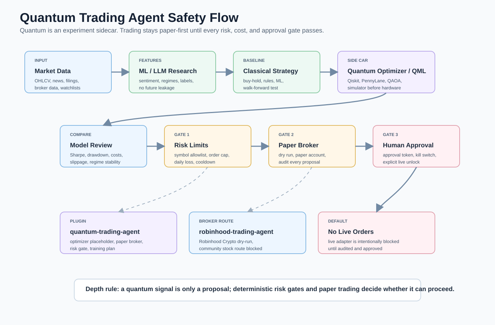

# Quantum Trading And Investing

This guide expands the quantum lane into stock, portfolio, investment, day-trading, and research workflows. It is for engineering and research. It is not financial advice, and live order placement should stay disabled until a human reviews the model, broker permissions, compliance rules, and risk controls.



Read this diagram as a research pipeline first and a trading pipeline second. Quantum tools are used for optimization or QML experiments, then compared with a classical baseline before any signal reaches risk checks, paper trading, or a human approval step.

## Big Idea

Use quantum computing as a sidecar, not as magic. The safe structure is:

```text
market data
  -> ML/LLM research module
  -> classical baseline strategy
  -> quantum optimizer or QML experiment
  -> compare results
  -> risk gates
  -> paper broker
  -> human approval
  -> optional live broker integration
```

## Standalone Setup

PowerShell:

```powershell
$MasterRepo = (Get-Location).Path  # run from repo root; $LanePath = Read-Host "Folder for quantum trading repos"; New-Item -ItemType Directory -Force $LanePath | Out-Null; Get-Content (Join-Path $MasterRepo "repo-lists\quantum-finance-trading.txt") | Where-Object { $_ -and $_ -notmatch '^#' } | ForEach-Object { git clone "https://github.com/$_.git" (Join-Path $LanePath ($_ -replace '/','-')) }
```

WSL/Bash:

```bash
read -rp "Path to Master-Repo-Use: " master_repo; read -rp "Folder for quantum trading repos: " lane_path; mkdir -p "$lane_path"; grep -vE '^(#|$)' "$master_repo/repo-lists/quantum-finance-trading.txt" | while read -r repo; do git clone "https://github.com/$repo.git" "$lane_path/${repo/\//-}"; done
```

Python lab:

```powershell
$LabPath = Read-Host "Folder for quantum trading lab"; New-Item -ItemType Directory -Force $LabPath | Out-Null; Set-Location $LabPath; python -m venv .venv; .\.venv\Scripts\Activate.ps1; python -m pip install --upgrade pip qiskit qiskit-finance qiskit-optimization pennylane yfinance pandas numpy scikit-learn matplotlib
```

## Quantum Finance And QML Repos

| Repo | Use it when | How it fits |
| --- | --- | --- |
| [qiskit-community/qiskit-finance](https://github.com/qiskit-community/qiskit-finance) | You want quantum finance examples. | Portfolio optimization and finance demos. |
| [qiskit-community/qiskit-machine-learning](https://github.com/qiskit-community/qiskit-machine-learning) | You want QML models. | Compare QML classifiers/regressors against classical baselines. |
| [qiskit-community/qiskit-optimization](https://github.com/qiskit-community/qiskit-optimization) | You want optimization problems. | Portfolio allocation, routing, scheduling, constraints. |
| [PennyLaneAI/pennylane](https://github.com/PennyLaneAI/pennylane) | You want hybrid quantum/classical ML. | Differentiable quantum models and QML experiments. |
| [tensorflow/quantum](https://github.com/tensorflow/quantum) | You want TensorFlow-based QML research. | Experimental QML pipeline. |
| [mit-han-lab/torchquantum](https://github.com/mit-han-lab/torchquantum) | You want PyTorch-oriented quantum ML. | QML models and research workflows. |
| [entropicalabs/openqaoa](https://github.com/entropicalabs/openqaoa) | You want QAOA tooling. | Portfolio-style combinatorial optimization experiments. |
| [jpmorganchase/QOKit](https://github.com/jpmorganchase/QOKit) | You want a QAOA optimization toolkit. | Compare optimization approaches. |
| [PaddlePaddle/Quantum](https://github.com/PaddlePaddle/Quantum) | You want Paddle Quantum tooling. | Quantum ML and research examples. |
| [VarunRathore137/The-Hybrid-Quantum-Portfolio-Optimizer](https://github.com/VarunRathore137/The-Hybrid-Quantum-Portfolio-Optimizer) | You want a hybrid quantum portfolio optimizer example. | Direct portfolio experiment reference. |
| [BIKASH1002/QML-Stock-Predictor](https://github.com/BIKASH1002/QML-Stock-Predictor) | You want QML stock prediction experiments. | QML prediction research. |
| [MonitSharma/Quantum-Finance-and-Numerical-Methods](https://github.com/MonitSharma/Quantum-Finance-and-Numerical-Methods) | You want quantum finance and numerical method examples. | Research and learning. |
| [ChiraagNadig/Quantum-ML-Research](https://github.com/ChiraagNadig/Quantum-ML-Research) | You want QML research material. | QML model exploration. |
| [DarkStarQuantumLab/Qauntum-trading-a-disturbance-in-the-force-of-supply-and-demand](https://github.com/DarkStarQuantumLab/Qauntum-trading-a-disturbance-in-the-force-of-supply-and-demand) | You want an experimental quantum trading repo to study. | Research only. |
| [alejomonbar/Quantum-Counselor-for-Portfolio-Investment](https://github.com/alejomonbar/Quantum-Counselor-for-Portfolio-Investment) | You want a portfolio investment quantum assistant example. | Study as an app pattern. |
| [QuantaScriptor/Quantum-Based-Portfolio-Diversification-QBPD](https://github.com/QuantaScriptor/Quantum-Based-Portfolio-Diversification-QBPD) | You want quantum-inspired portfolio diversification. | Portfolio allocation research. |
| [MrDecryptDecipher/Sentinel](https://github.com/MrDecryptDecipher/Sentinel) | You want a quantum-trading-adjacent research repo. | Treat as experimental. |

## Day Trading And Broker Repos

| Repo | Use it when | Safety default |
| --- | --- | --- |
| [alpacahq/alpaca-py](https://github.com/alpacahq/alpaca-py) | You want Alpaca's current Python SDK. | Paper trading first. |
| [alpacahq/alpaca-trade-api-python](https://github.com/alpacahq/alpaca-trade-api-python) | You need legacy Alpaca Python examples. | Prefer paper account. |
| [alpacahq/alpaca-mcp-server](https://github.com/alpacahq/alpaca-mcp-server) | You want an MCP server for Alpaca tools. | Expose paper tools before live tools. |
| [Lumiwealth/lumibot](https://github.com/Lumiwealth/lumibot) | You want a Python trading/backtesting framework. | Backtest, paper, then review. |
| [nautechsystems/nautilus_trader](https://github.com/nautechsystems/nautilus_trader) | You want a professional-grade trading/backtesting engine. | Treat live mode as high risk. |
| [AsyncAlgoTrading/aat](https://github.com/AsyncAlgoTrading/aat) | You want asynchronous algorithmic trading tooling. | Start with simulated mode. |
| [vnpy/vnpy](https://github.com/vnpy/vnpy) | You want a trading platform framework. | Use sim/paper before broker connections. |
| [kernc/backtesting.py](https://github.com/kernc/backtesting.py) | You want simple Python backtesting. | Good first baseline. |
| [pmorissette/bt](https://github.com/pmorissette/bt) | You want flexible backtesting. | Good for portfolio strategies. |
| [gbeced/pyalgotrade](https://github.com/gbeced/pyalgotrade) | You want classic algorithmic trading examples. | Research/backtest only. |
| [erdewit/ib_insync](https://github.com/erdewit/ib_insync) | You want Interactive Brokers Python integration. | Strong permissions required. |
| [Jesse-ai/jesse](https://github.com/Jesse-ai/jesse) | You want crypto strategy research/backtesting. | Paper/simulation first. |
| [tejaslinge/Alpaca-ROC-Trading-Bot](https://github.com/tejaslinge/Alpaca-ROC-Trading-Bot) | You want an Alpaca ROC bot example. | Study pattern, do not copy to live. |
| [tejaslinge/Alpaca-StochRSI-EMA-Trading-Bot](https://github.com/tejaslinge/Alpaca-StochRSI-EMA-Trading-Bot) | You want an Alpaca indicator bot example. | Study pattern, do not copy to live. |
| [marcozanetti-dev/intraday-mean-reversion-costs-aware](https://github.com/marcozanetti-dev/intraday-mean-reversion-costs-aware) | You want an intraday mean reversion research repo. | Good for cost-aware backtest ideas. |

## ML, RL, And LLM Trading Repos

| Repo | Use it when | Training note |
| --- | --- | --- |
| [huseinzol05/Stock-Prediction-Models](https://github.com/huseinzol05/Stock-Prediction-Models) | You want many stock prediction model examples. | Watch for leakage and stale assumptions. |
| [Albert-Z-Guo/Deep-Reinforcement-Stock-Trading](https://github.com/Albert-Z-Guo/Deep-Reinforcement-Stock-Trading) | You want deep RL stock trading examples. | Use walk-forward evaluation. |
| [ebrahimpichka/DeepRL-trade](https://github.com/ebrahimpichka/DeepRL-trade) | You want DeepRL trading examples. | Simulate with costs and slippage. |
| [RezaSoleymanifar/neuralHFT](https://github.com/RezaSoleymanifar/neuralHFT) | You want HFT-oriented neural research. | High-risk; research only. |
| [oyi77/Crypto-RL-Trading-Bot](https://github.com/oyi77/Crypto-RL-Trading-Bot) | You want crypto RL bot examples. | Paper trade only. |
| [fsaavedra0003/Agentic-AI-Trading-Bot-with-LLM-reasoning-sentiment-analysis](https://github.com/fsaavedra0003/Agentic-AI-Trading-Bot-with-LLM-reasoning-sentiment-analysis) | You want LLM reasoning/sentiment trading examples. | Add strict gates before broker calls. |
| [padmarajkore/Ai-crypto-trading-system](https://github.com/padmarajkore/Ai-crypto-trading-system) | You want AI crypto trading system ideas. | Use sandbox/exchange testnet. |
| [AxelGard/cira](https://github.com/AxelGard/cira) | You want a crypto intelligent robot assistant example. | Research assistant pattern. |
| [paperswithbacktest/awesome-systematic-trading](https://github.com/paperswithbacktest/awesome-systematic-trading) | You want systematic trading resources. | Research queue. |
| [grananqvist/Awesome-Quant-Machine-Learning-Trading](https://github.com/grananqvist/Awesome-Quant-Machine-Learning-Trading) | You want quant ML trading resources. | Research queue. |
| [wangzhe3224/awesome-systematic-trading](https://github.com/wangzhe3224/awesome-systematic-trading) | You want another systematic trading resource list. | Research queue. |

## MCP, Memory, And Risk Tools

| Repo | Use it when | Why it matters |
| --- | --- | --- |
| [financial-datasets/mcp-server](https://github.com/financial-datasets/mcp-server) | You want financial data through MCP. | Cleaner tool boundary for agents. |
| [System-R-AI/systemr-python](https://github.com/System-R-AI/systemr-python) | You want risk intelligence tooling. | Risk gate and pre-trade review ideas. |
| [mnemox-ai/tradememory-protocol](https://github.com/mnemox-ai/tradememory-protocol) | You want trade memory patterns. | Durable reasoning, audit, and trade context. |
| [wshobson/maverick-mcp](https://github.com/wshobson/maverick-mcp) | You want a finance/market MCP server to study. | Market data and agent tool pattern. |
| [aitrados/finance-trading-ai-agents-mcp](https://github.com/aitrados/finance-trading-ai-agents-mcp) | You want finance trading AI agents with MCP ideas. | MCP agent pattern. |
| [atilaahmettaner/tradingview-mcp](https://github.com/atilaahmettaner/tradingview-mcp) | You want TradingView-related MCP tooling. | Chart/research integration. |
| [VictorVVedtion/trading-skills](https://github.com/VictorVVedtion/trading-skills) | You want trading skill prompts/resources. | Agent prompt research. |

## Limiters For Trading Agents

Use these before any agent can touch broker actions:

| Limiter | Default |
| --- | --- |
| Broker mode | Paper trading only |
| Asset allowlist | Only symbols explicitly listed |
| Max position size | Percent of portfolio, not unlimited |
| Max daily loss | Stop all trading after threshold |
| Max order value | Hard cap per order |
| Max orders per day | Hard cap with cooldown |
| Human approval | Required for live order |
| Kill switch | Any failure or drawdown can stop all orders |
| Data freshness | Refuse stale quotes/signals |
| Backtest requirement | Strategy must pass test window before paper trading |
| Live trading | Disabled unless config, environment, and approval all agree |

## Training Module For ML, RL, QML, And LLMs

Training setup:

1. Define the task: prediction, ranking, allocation, risk classification, or order timing.
2. Build features: price/volume, volatility, indicators, market regime, news sentiment, fundamentals, and macro data.
3. Split by time: train, validation, test, then walk-forward. Never random-shuffle time series for trading evaluation.
4. Add costs: commissions, spread, slippage, latency, borrow fees, and taxes if relevant.
5. Train baselines first: buy-and-hold, moving average, equal weight, mean variance, simple rules.
6. Train ML/RL/QML models only after baselines exist.
7. Evaluate: Sharpe, Sortino, max drawdown, turnover, hit rate, profit factor, tail risk, and stability across regimes.
8. Paper trade before live.
9. Log all decisions, prompts, data versions, model versions, and approvals.

LLM setup:

- Use LLMs for research summaries, sentiment extraction, scenario planning, and risk explanations.
- Do not let an LLM directly place orders.
- Put every LLM output through a deterministic risk gate.
- Ground LLMs with RAG over filings, notes, docs, and strategy rules.
- Store durable assumptions and failures in memory.

ML/RL setup:

- Use scikit-learn or PyTorch for supervised models.
- Use FinRL-style environments for RL experiments.
- Reward functions must include costs and drawdown penalties.
- Require out-of-sample and walk-forward results.
- Reject strategies that only work in one market regime.

QML/quantum setup:

- Use Qiskit/PennyLane simulators first.
- Compare QML/quantum optimizer output against classical baselines.
- Keep circuits small.
- Track quantum cloud costs separately.
- Do not claim quantum advantage without repeated evidence.

## Starter Plugin

A safe starter scaffold lives at [plugins/quantum-trading-agent](../plugins/quantum-trading-agent/README.md).

It includes:

- Paper-trading default.
- Risk gate config.
- CLI commands.
- Quantum optimizer placeholder.
- Broker adapter stub that refuses live orders.
- Training plan for ML, RL, QML, and LLM workflows.
